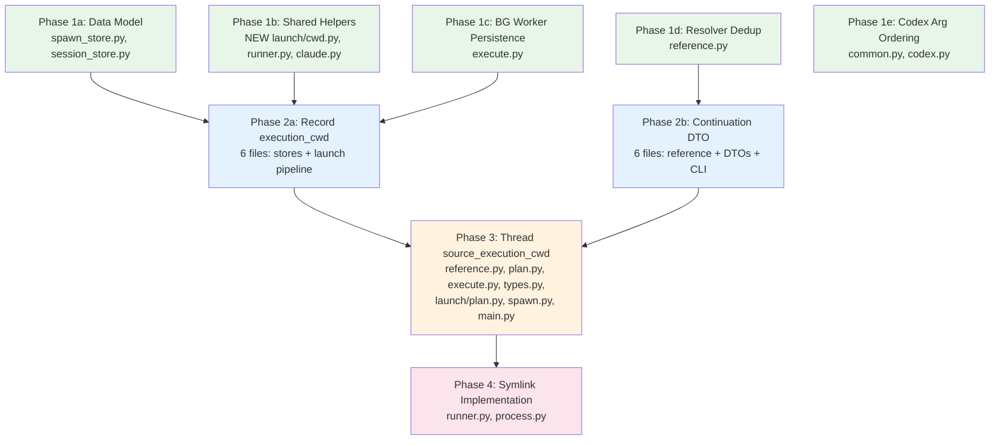

# Implementation Plan: Fix Claude CWD/Session Lookup Mismatch (Revised)

## Summary

9 phases in 4 rounds fixing the Claude CWD/session lookup mismatch and Codex argument ordering. Incorporates 6 entropy-reduction refactorings (R1-R6) as prep phases that front-load structural cleanup before the feature work.

## Phase Dependency Map

## Execution Rounds

| Round | Phases | Parallelism | Notes |
|-------|--------|-------------|-------|
| **Round 1** | 1a, 1b, 1c, 1d, 1e | 5-way parallel | All prep phases + data model. Non-overlapping file sets. |
| **Round 2** | 2a, 2b | 2-way parallel | Feature plumbing + DTO consolidation. Non-overlapping file sets. |
| **Round 3** | 3 | Sequential | Thread source_execution_cwd through consolidated DTOs. |
| **Round 4** | 4 | Sequential | Symlink implementation. The fix. |

**Critical path**: 1a + 1b + 1c --> 2a --> 3 --> 4 (4 sequential rounds).
**Phase 1e completes in Round 1** (no downstream dependencies).
**Phase 2b completes in Round 2** (feeds into Phase 3 alongside 2a).

## Refactoring Integration

| Refactoring | Phase | Priority | Rationale |
|-------------|-------|----------|-----------|
| R1: Shared CWD predicate | 1b | MUST | Prevents CWD condition duplication between runner.py and execute.py |
| R2: Promote Claude slug | 1b | MUST | Phase 4 needs `project_slug()` in runner.py and process.py |
| R3: Unified continuation DTO | 2b | SHOULD | Phase 3 adds `source_execution_cwd` to 2 DTOs instead of 6 |
| R4: BG worker plan persistence | 1c | SHOULD | Phase 3 gets auto-persistence instead of manual argv serialization |
| R5: Resolver dedup | 1d | SHOULD | Clean resolver before adding `source_execution_cwd` population |
| R6: Pre-subcommand flags | 1e | SHOULD | Codex resume uses infrastructure instead of bypassing it |

## Phase Summary

### Round 1 (Parallel)

| Phase | Files | Scope | Risk |
|-------|-------|-------|------|
| **1a** | `spawn_store.py`, `session_store.py` | Add `execution_cwd` fields to models and projections | Low |
| **1b** | NEW `launch/cwd.py`, `runner.py`, `claude.py` | Extract shared CWD predicate + promote slug to public | Low |
| **1c** | `execute.py` | Persist BG worker params to disk, replace argv explosion | Medium |
| **1d** | `reference.py` | Extract shared constructor from 3 near-identical resolver branches | Low-Medium |
| **1e** | `common.py`, `codex.py` | Add `subcommand` param to `build_harness_command`, use for Codex resume | Low-Medium |

### Round 2 (Parallel)

| Phase | Files | Scope | Risk |
|-------|-------|-------|------|
| **2a** | `spawn_store.py`, `session_store.py`, `session_scope.py`, `execute.py`, `runner.py`, `process.py` | Wire `execution_cwd` through store APIs and write it from all layers | Medium |
| **2b** | `reference.py`, `models.py`, `plan.py`, `types.py`, `cli/spawn.py`, `cli/main.py` | Expand `SessionContinuation` as the single continuation carrier | Medium |

### Round 3

| Phase | Files | Scope | Risk |
|-------|-------|-------|------|
| **3** | `reference.py`, `plan.py`, `execute.py`, `types.py`, `launch/plan.py`, `cli/spawn.py`, `cli/main.py` | Add `source_execution_cwd` to consolidated DTOs and populate from stores | Low |

### Round 4

| Phase | Files | Scope | Risk |
|-------|-------|-------|------|
| **4** | `runner.py`, `process.py` | Implement `_ensure_claude_session_accessible()` symlink + call from both sites | Medium |

## File Touch Map

| File | 1a | 1b | 1c | 1d | 1e | 2a | 2b | 3 | 4 |
|------|----|----|----|----|----|----|----|----|---|
| `state/spawn_store.py` | **models** | | | | | **API** | | | |
| `state/session_store.py` | **models** | | | | | **API** | | | |
| `launch/cwd.py` | | **NEW** | | | | | | | |
| `launch/runner.py` | | **import** | | | | **update** | | | **call** |
| `harness/claude.py` | | **rename** | | | | | | | |
| `ops/spawn/execute.py` | | | **refactor** | | | **write** | | | |
| `ops/reference.py` | | | | **dedup** | | | **expand** | **field** | |
| `harness/common.py` | | | | | **param** | | | | |
| `harness/codex.py` | | | | | **use** | | | | |
| `launch/session_scope.py` | | | | | | **param** | | | |
| `launch/process.py` | | | | | | **write** | | | **call** |
| `ops/spawn/models.py` | | | | | | | **field** | | |
| `ops/spawn/plan.py` | | | | | | | **expand** | **field** | |
| `launch/types.py` | | | | | | | **field** | | |
| `cli/spawn.py` | | | | | | | **pass** | **pass** | |
| `cli/main.py` | | | | | | | **pass** | **pass** | |
| `launch/plan.py` | | | | | | | | **field** | |
| `ops/spawn/prepare.py` | | | | | | | **pass** | | |

## Agent Staffing

### Round 1 (5 parallel)

All phases: `coder` (standard model). Each gets 1x reviewer (correctness). `verifier` for testing.
- Phase 1c (BG worker persistence): stronger model recommended due to execute.py complexity.

### Round 2 (2 parallel)

- Phase 2a: `coder` + 1x reviewer (verify execute.py pre-compute matches runner.py). `verifier`.
- Phase 2b: `coder` + 1x reviewer (verify DTO threading is complete, no orphaned fields). `verifier`.

### Round 3

- Phase 3: `coder` + 1x reviewer (verify all resolver paths populate the field). `verifier`.

### Round 4

- Phase 4: `coder` + 2x reviewers (correctness + security/symlink safety). `verifier` + `smoke-tester`.

## Verification Gate Per Phase

Every phase must pass before downstream phases begin:
1. `uv run ruff check .` -- 0 warnings
2. `uv run pyright` -- 0 errors
3. `uv run pytest-llm` -- all green
4. Commit checkpoint
