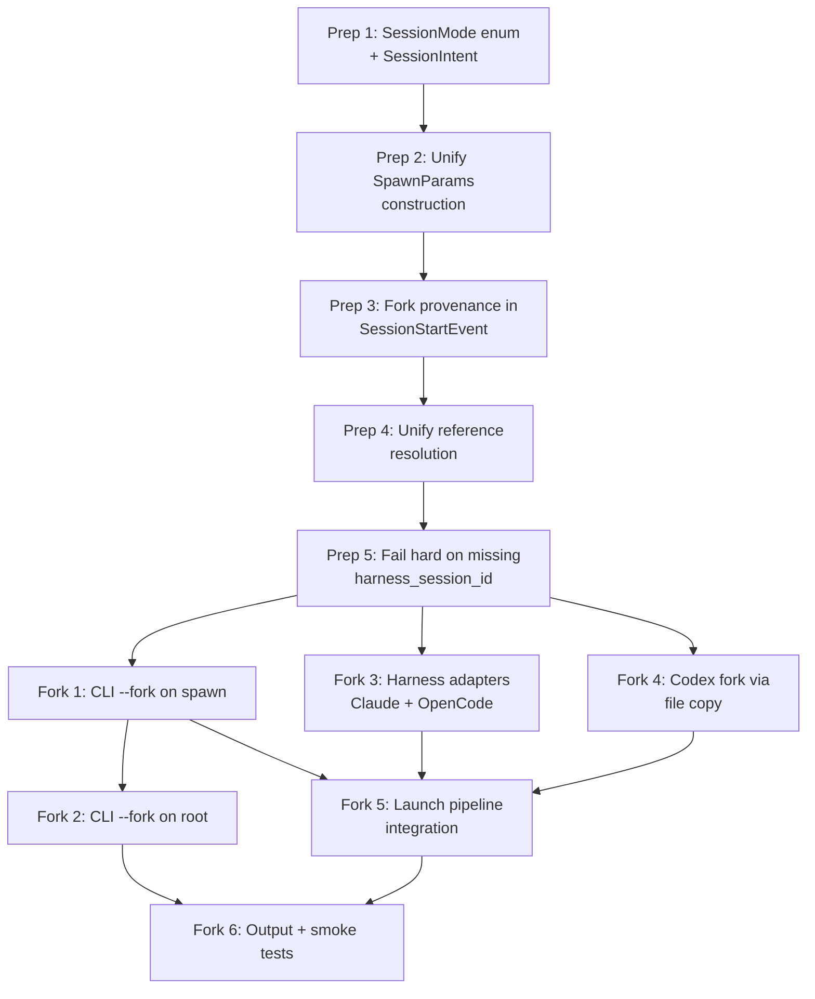

# Fork Feature Implementation Plan

## Execution Overview

Two work streams: **Prep Refactors** (reduce entropy) → **Fork Implementation** (build the feature). Preps are sequential (each builds on the prior). Fork phases have a dependency graph allowing some parallelism.

## Execution Rounds

| Round | Phases | Notes |
|-------|--------|-------|
| 1 | Prep 1 | Foundation — SessionMode enum replaces boolean confusion |
| 2 | Prep 2 | Depends on Prep 1 (SessionMode flows through SpawnParams) |
| 3 | Prep 3 | Adds fork provenance field (independent of SpawnParams refactor but logically next) |
| 4 | Prep 4 | Shared reference resolver — needed by fork CLI phases |
| 5 | Prep 5 | Validation hardening — must be in place before fork touches continue path |
| 6 | Fork 1, Fork 3, Fork 4 | **Parallel round** — CLI surface, Claude/OpenCode adapters, Codex adapter are independent |
| 7 | Fork 2, Fork 5 | Fork 2 (root CLI) depends on Fork 1 patterns. Fork 5 (pipeline) depends on Fork 1 + Fork 3 + Fork 4 |
| 8 | Fork 6 | Output + smoke tests — needs all prior phases |

## Agent Staffing Summary

| Phase | Implementer | Reviewer Focus | Tester |
|-------|-------------|----------------|--------|
| Prep 1 | gpt-5.3-codex | Design alignment (gpt-5.4) | verification-tester |
| Prep 2 | gpt-5.3-codex | Code reduction (gpt-5.4) | verification-tester |
| Prep 3 | gpt-5.3-codex | Data model correctness (gpt-5.4) | verification-tester |
| Prep 4 | gpt-5.3-codex | Correctness + edge cases (gpt-5.4) | verification-tester |
| Prep 5 | gpt-5.3-codex | Security/error paths (gpt-5.4) | verification-tester |
| Fork 1 | gpt-5.3-codex | CLI ergonomics + validation (gpt-5.4) | verification-tester |
| Fork 2 | gpt-5.3-codex | CLI consistency (gpt-5.4) | verification-tester |
| Fork 3 | gpt-5.3-codex | Harness correctness (gpt-5.4) | verification-tester |
| Fork 4 | gpt-5.3-codex | Crash safety + correctness (gpt-5.4, opus) | verification-tester + unit-tester |
| Fork 5 | gpt-5.3-codex | Architecture alignment + correctness (gpt-5.4, opus) | verification-tester |
| Fork 6 | gpt-5.3-codex | UX + completeness (gpt-5.4) | smoke-tester |

## Risk Front-Loading

- **Prep 1 (SessionMode)** is the highest-risk prep — it replaces boolean state management across the launch pipeline. If the enum design doesn't work, later phases all need rethinking.
- **Fork 4 (Codex file copy)** is the highest-risk fork phase — it does filesystem manipulation of another tool's internal state. Staffed with extra review depth (opus + gpt-5.4) and unit tests.
- **Fork 5 (pipeline integration)** is the most complex fork phase — it threads SessionMode.FORK through multiple decision points in the launch pipeline. Staffed with architecture-focused review.
