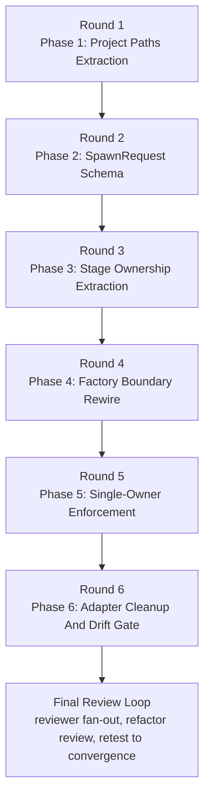

# R06 Plan Overview

## Planning Basis

This work item does not currently include a `design/spec/` tree with EARS leaf
IDs. To keep planning executable, this plan uses the stable IDs that do exist in
the approved design package:

- `DEP-R01` from `design/refactors.md`
- `REQ-SC*` from `requirements.md` success criteria
- `ARCH-I*` from `design/launch-composition-invariant.md`
- `FEAS-FV*` from `design/feasibility.md`

`plan/leaf-ownership.md` treats those IDs as the executable ownership leaves for
R06. If a later redesign adds a spec tree, the ledger should be rewritten to the
new canonical leaf IDs before execution resumes.

## Parallelism Posture

**Posture:** `sequential`

**Cause:** R06 is gated by one prerequisite and four shared seams that serialize
the work:

1. `DEP-R01` must land first because `LaunchRuntime` cannot carry
   `project_paths: ProjectPaths` until the type exists.
2. The raw `SpawnRequest` artifact is the only prepare->execute contract. Until
   that schema exists, no later phase has a stable input boundary.
3. The factory signature, bypass owner, and stage ownership are global seams.
   Every driver and executor depends on them, so they must converge before the
   driver rewires begin.
4. Dead-type deletion and the CI drift gate are only safe after all driving and
   driven adapters are on the new ownership model.

There is no honest parallel coder split here without overlapping the same launch
core files and invalidating the single-owner constraints. Parallelism lives
inside each phase's tester lanes, not across implementation phases.

## Rounds

| Round | Phase | Why this boundary exists |
|---|---|---|
| 1 | Phase 1 - Project Paths Extraction | Unblocks `LaunchRuntime.project_paths`; all later phases depend on it. |
| 2 | Phase 2 - SpawnRequest Schema | Establishes the persisted raw-input contract before any factory rewire. |
| 3 | Phase 3 - Stage Ownership Extraction | Moves composition logic into real stage modules before the factory consumes raw input. |
| 4 | Phase 4 - Factory Boundary Rewire | Changes the central seam (`build_launch_context`) and dry-run parity; later rewires build on this contract. |
| 5 | Phase 5 - Single-Owner Enforcement | Rewires drivers, executors, fork ordering, and session-id observation onto the new seam. |
| 6 | Phase 6 - Adapter Cleanup And Drift Gate | Deletes obsolete DTOs/guards and closes verification on the final architecture. |

## Refactor Handling

| Refactor ID | Handling | Phase ownership | Notes |
|---|---|---|---|
| `DEP-R01` | Foundational prep | Phase 1 | Required before any `LaunchRuntime` work because `ProjectPaths` does not exist yet. |
| `R06` | Decomposed into six executable phases | Phases 2-6 | Split by boundary establishment first, single-owner rewires second, deletion/gate last. |

## Mermaid Fanout

## Staffing Contract

### Per-phase teams

| Phase | Builder lane | Tester lanes | Reviewer policy |
|---|---|---|---|
| Phase 1 | `@coder` on profile default model | `@verifier`, `@unit-tester`, `@smoke-tester` | Escalate only if path extraction forces cross-module ownership changes beyond launch/runtime callers. |
| Phase 2 | `@coder` on profile default model | `@verifier`, `@unit-tester`, `@smoke-tester` | Escalate only if persisted artifact compatibility forces a design-level DTO change outside the approved schema. |
| Phase 3 | `@coder` on profile default model | `@verifier`, `@unit-tester`, `@smoke-tester` | Escalate only if stage extraction cannot keep `harness/adapter.py` contract-only. |
| Phase 4 | `@coder` on profile default model | `@verifier`, `@unit-tester`, `@smoke-tester` | Escalate if the factory boundary cannot switch to raw input without redesigning the approved pipeline order. |
| Phase 5 | `@coder` on profile default model | `@verifier`, `@unit-tester`, `@smoke-tester` | Escalate on unresolved fork/session-ordering findings or if a tester finds a second session-id path after the rewrite. |
| Phase 6 | `@coder` on profile default model | `@verifier`, `@unit-tester`, `@smoke-tester` | Escalate if cleanup exposes a structural mismatch between the invariant prompt and the shipped architecture. |

### Final review loop

- `@reviewer` lane 1 on the default reviewer model, focus `design alignment`
  and `contract compliance` against `requirements.md`,
  `design/architecture/launch-core.md`, and
  `.meridian/invariants/launch-composition-invariant.md`.
- `@reviewer` lane 2 on a different model family, focus `concurrent state`,
  `fork-after-row ordering`, and `session lineage/session-id observation`.
- `@refactor-reviewer` on profile default, focus `single-owner enforcement`,
  `stage ownership`, and `driven-port mechanism leakage`.
- After findings, rerun the owning `@coder`, then rerun only the tester lanes
  that cover the touched leaves, then rerun the full review fan-out until no
  new substantive findings appear.

### Escalation policy

- Tester findings go directly back to the phase `@coder` when the fix stays
  inside the current phase boundary.
- Spawn a scoped `@reviewer` during a phase only when one of these holds:
  the finding crosses phase boundaries, contradicts a declared invariant,
  or survives one coder fix plus one tester re-run.
- Do not spawn parallel coders inside a phase. If a phase looks too large for a
  single coder, the plan is wrong and must be revised before execution.

