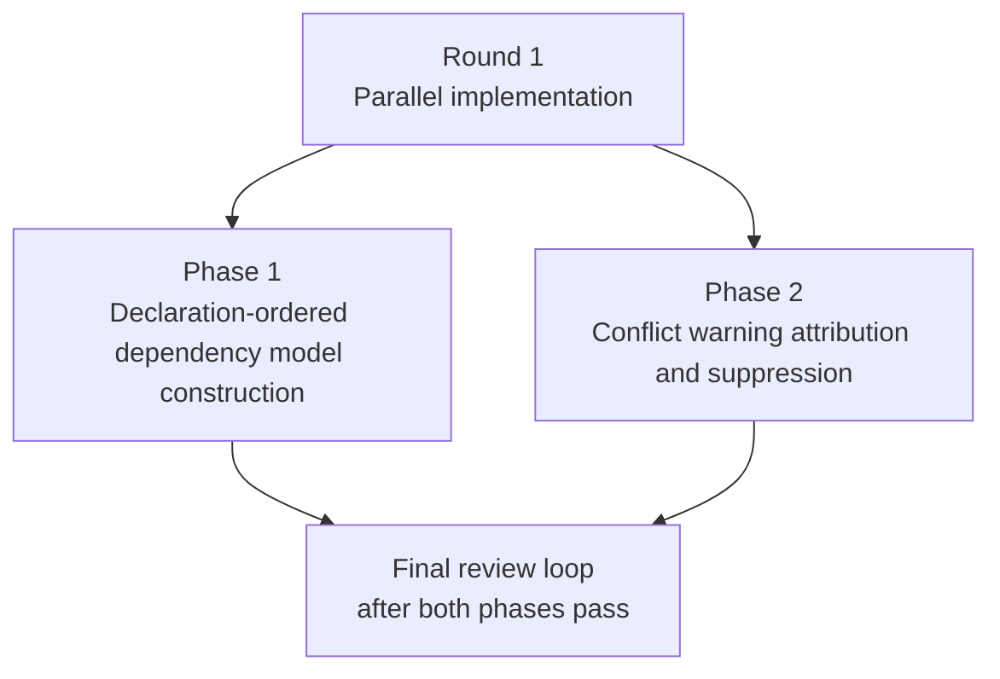

# Implementation Plan: Model Alias Declaration-Order Merge

## Parallelism Posture

**Posture:** parallel

**Cause:** The implementation splits cleanly into two disjoint write sets in the `mars-agents` repo. Phase 1 changes declaration-ordered dependency model construction in `src/sync/mod.rs` and carries the shared-helper refactor. Phase 2 changes conflict-warning attribution and suppression in `src/models/mod.rs`. Each phase claims an exclusive set of EARS leaves and can be verified independently.

## Execution Rounds

| Round | Phases | Justification |
|---|---|---|
| 1 | Phase 1, Phase 2 | Phase 1 owns the topo-safe declaration-order logic plus R-1 in `src/sync/mod.rs`. Phase 2 owns only diagnostics behavior inside `merge_model_config()`. They do not share write targets, and neither phase needs the other to compile or to validate its claimed leaves. |

## Refactor Handling

| Refactor | Phase | Handling | Why this sequence |
|---|---|---|---|
| R-1 | Phase 1 | Extract `declaration_ordered_dep_models(graph, config)` and route both `resolve_graph()` and `finalize()` through it in the same change that introduces the declaration-order-aware Kahn pass. | The refactor is the implementation vehicle for S-FINALIZE-1 and prevents the new ordering logic from being duplicated across sync call sites. |

## Phase Dependency Map

## Staffing

| Phase | Builder | Tester lanes | Intermediate escalation reviewer policy |
|---|---|---|---|
| Phase 1 | `@coder` on `gpt-5.3-codex` | `@verifier` on `gpt-5.4-mini`; `@unit-tester` on `gpt-5.2`; `@smoke-tester` on `gpt-5.4` | If testers find any dependency-before-dependent regression, `resolve_graph()` vs `finalize()` mismatch, or nondeterministic ordering, escalate to `@reviewer` on `gpt-5.4`. |
| Phase 2 | `@coder` on `gpt-5.3-codex` | `@verifier` on `gpt-5.4-mini`; `@unit-tester` on `gpt-5.2`; `@smoke-tester` on `claude-sonnet-4-6` | If testers find warning wording drift from spec, ambiguous winner/loser attribution, or consumer-override suppression regressions, escalate to `@reviewer` on `gpt-5.2`. |

## Final Review Loop

- `@reviewer` on `gpt-5.4`: design alignment, topological invariants, and cross-phase consistency between runtime merge behavior and persisted `models-merged.json`.
- `@reviewer` on `gpt-5.2`: determinism, warning edge cases, non-blocking behavior, and test-gap hunting.
- `@reviewer` on `claude-opus-4-6`: CLI-visible diagnostic clarity and end-to-end sync behavior.
- `@refactor-reviewer` on `claude-sonnet-4-6`: helper placement, duplication removal, and module-boundary discipline.
- After each review round, hand fixes to `@coder` on `gpt-5.3-codex`, rerun only the affected tester lanes, then rerun reviewers until convergence.

## Escalation Policy

- Intermediate phases stay tester-led by default.
- Use scoped reviewer escalation only when testers find a real behavioral mismatch they cannot close with coder plus retest.
- Prefer `gpt-5.4` for graph-ordering or finalize/resolve consistency questions, `gpt-5.2` for warning-contract or determinism questions, and `claude-opus-4-6` for end-to-end diagnostic clarity questions.
