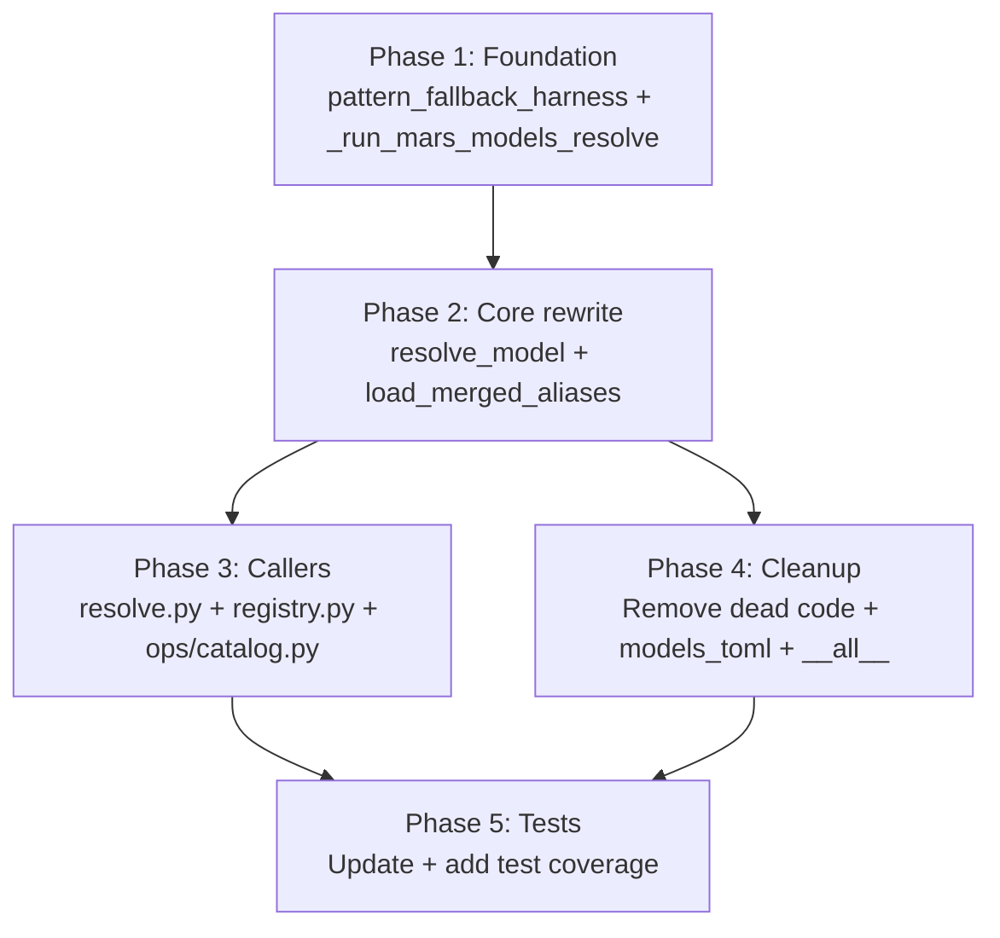

# Plan: Mars as Single Authority for Model→Harness Resolution

## Delta Summary

Current state: `resolve_model()` calls `load_merged_aliases()` → `route_model()` with config-driven harness patterns. Two redundant resolution systems.

Target state: `resolve_model()` calls `mars models resolve <name> --json` → pattern fallback for raw model IDs → hard error if mars broken. Mars is always present, no offline fallback.

**Live bug fix included:** The resolved `model_id` (not the alias name) must be what gets passed to the harness CLI. Currently `codex` alias passes `"codex"` as the model string instead of `"gpt-5.3-codex"`.

## Phase Dependency Graph

## Execution Rounds

| Round | Phases | Rationale |
|-------|--------|-----------|
| 1 | Phase 1 | Foundation — new functions everyone depends on |
| 2 | Phase 2 | Core rewrite — uses Phase 1 functions |
| 3 | Phase 3, Phase 4 | Independent: callers update vs dead code removal |
| 4 | Phase 5 | Tests verify the full change |

## Agent Staffing

Each phase: 1 coder (gpt-5.3-codex). After all phases complete:

- 3 reviewers fanned out:
  - Reviewer 1 (opus): design alignment — verify code matches resolution-flow.md and removal-map.md
  - Reviewer 2 (gpt-5.4): correctness — error paths, edge cases, the model_id-vs-alias bug fix
  - Reviewer 3 (gpt-5.2): API surface — verify __all__ exports, public interface stability
- 1 smoke-tester: `meridian spawn -m opus`, `meridian spawn -m codex`, `meridian spawn -m claude-opus-4-6`
