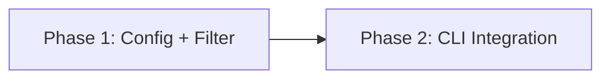

# Implementation Plan — Model Visibility Filtering

## Delta Summary

Add display-level visibility filtering to `mars models list`. Three changes: config schema, filtering function, CLI integration. Two phases — foundation then consumer.

## Phase Dependency

**Round 1:** Phase 1 — defines the types and logic Phase 2 consumes.
**Round 2:** Phase 2 — wires everything into the CLI.

## Phase Overview

| Phase | Files | Scope | Depends On |
|-------|-------|-------|------------|
| 1 | `src/config/mod.rs`, `src/models/mod.rs` | `ModelVisibility` struct, validation, `filter_by_visibility()` | — |
| 2 | `src/cli/models.rs` | `--include`/`--exclude` flags, visibility loading, filter call in `run_list()` | Phase 1 |

## Staffing

Each phase: 1 coder + 1 verifier. Small feature — no fan-out needed within phases. A single reviewer with design-alignment focus after Phase 2 covers the whole feature.

## Risk Assessment

Low risk. All changes are additive — no existing behavior modified. `glob_match()` is proven. The only integration point is `run_list()`, which is straightforward.
