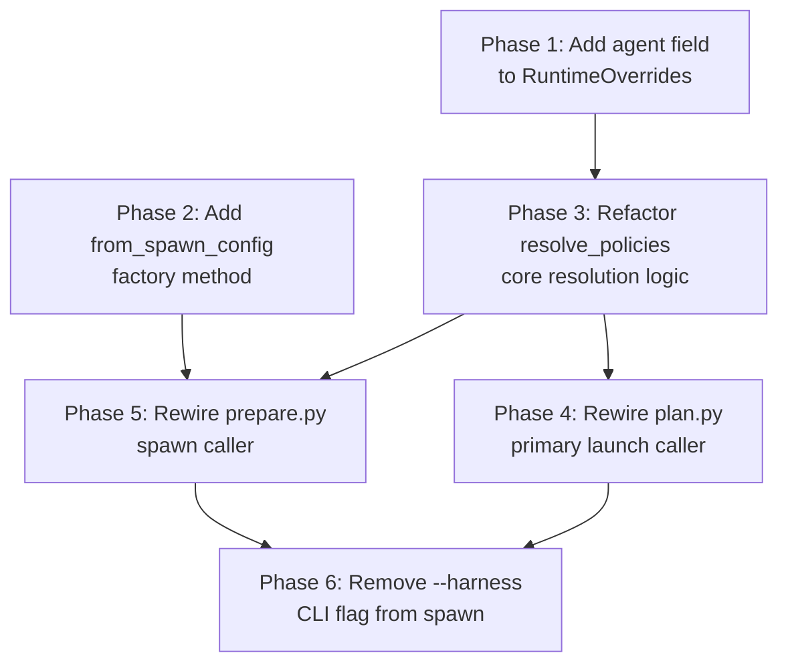

# Resolve Precedence Refactor: Implementation Plan

## Phase Dependency Graph



## Execution Rounds

```
Round 1: Phase 1, Phase 2     (independent foundation changes)
Round 2: Phase 3              (core resolve_policies refactor — depends on Phase 1)
Round 3: Phase 4, Phase 5     (caller rewiring — independent of each other, both need Phase 3)
Round 4: Phase 6              (CLI cleanup — needs both callers updated first)
```

## Phase Summary

| Phase | Scope | Files | Risk |
|-------|-------|-------|------|
| 1 | Add `agent` field to `RuntimeOverrides` + factory methods | `overrides.py` | Low — additive, no behavior change |
| 2 | Add `from_spawn_config()` factory method | `overrides.py` | Low — additive, no callers yet |
| 3 | Refactor `resolve_policies()` signature + body | `resolve.py` | **High** — core logic change |
| 4 | Rewire `plan.py` to use new resolve_policies | `plan.py` | Medium — caller simplification |
| 5 | Rewire `prepare.py` to use new resolve_policies | `prepare.py` | Medium — caller simplification |
| 6 | Remove `--harness` flag from `meridian spawn` CLI | `cli/spawn.py` | Low — flag removal + cleanup |

## Risk Notes

- **Phase 3 is the critical path.** It changes the core resolution logic that Phase 4 and Phase 5 depend on. If the new `resolve_policies()` signature is wrong, both callers need rework.
- **Phase 3 is front-loaded** because it's the highest-risk phase and produces the interface that downstream phases consume.
- **Phases 1 and 2 are pure additions** — they add fields and methods without changing existing behavior, so they can't break anything.
- **Phase 6 is last** because it's the only CLI-facing change and requires both callers to be updated first (the `--harness` value currently flows through both paths).
