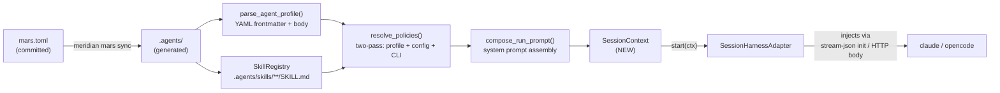
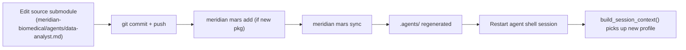

# Agent Loading

> How meridian-channel's existing `.agents/` machinery — mars sync, profile
> parsing, skill loading, prompt composition — flows into a **long-lived**
> Claude Code session at startup, and how the same pipeline stays neutral so
> opencode (V1) and codex (TBD) can plug in without rewriting the loader.

This doc is about **reuse, not rewrite**. The agent profile remains the unit of
domain specialization. What changes is that loading must produce a
`SessionContext` that a session-lived harness adapter can consume — instead of
the one-shot `SpawnParams` bundle that today's `SubprocessHarness.build_command`
expects. Decision 2 in `requirements.md`: *"Reuses meridian-channel's existing
.agents/ loading machinery so the data-analyst agent profile + biomedical skills
are managed through mars sync, not hand-written into the backend."*

## 1. Framing

The agent profile is the unit of domain specialization. Loading an agent into a
running session means executing this pipeline once, at session start, and then
holding the result for the lifetime of the harness subprocess:



The first six boxes are **unchanged** — they live in
`src/meridian/lib/catalog/`, `src/meridian/lib/launch/resolve.py`, and
`src/meridian/lib/launch/prompt.py` today. The new work is the
**`SessionContext`** DTO and the **session-lived adapter family** that consumes
it (designed in detail in `harness-abstraction.md`; this doc only covers what
the loader hands over).

## 2. What exists today

These functions are the substrate. They are reused as-is.

### `parse_agent_profile(path)` — `src/meridian/lib/catalog/agent.py:73`

Reads a markdown file with YAML frontmatter and returns an `AgentProfile`:

```python
def parse_agent_profile(path: Path) -> AgentProfile:
    """Parse a single markdown agent profile file."""
```

`AgentProfile` carries: `name`, `description`, `model`, `harness`, `skills`,
`tools`, `disallowed_tools`, `mcp_tools`, `sandbox`, `effort`, `approval`,
`autocompact`, `body` (the markdown body — this becomes the system prompt
seed), `path`, `raw_content`.

### `load_agent_profile(name, repo_root)` — `catalog/agent.py:197`

Resolves a profile by stem or frontmatter name from
`<repo_root>/.agents/agents/*.md`. Errors with a clear "run `meridian mars
sync`" message if missing.

### `SkillRegistry` + `resolve_skills_from_profile(...)` — `catalog/skill.py`, `launch/resolve.py:73`

```python
def resolve_skills_from_profile(
    *,
    profile_skills: tuple[str, ...],
    repo_root: Path,
    readonly: bool = False,
) -> ResolvedSkills:
    """Load and resolve skills declared in an agent profile."""
```

`ResolvedSkills` carries `skill_names`, `loaded_skills` (each with `.name`,
`.path`, `.content`), and `missing_skills` for warnings. `SkillRegistry` walks
`.agents/skills/**/SKILL.md`.

### `resolve_policies(...)` — `launch/resolve.py`

The two-pass policy resolver. Quote from `resolve.py:482`:

> Two-pass resolution is required because selecting an agent determines
> profile overrides, while profile overrides participate in final layer
> resolution for model/harness/safety fields.

Produces `ResolvedPolicies(profile, model, harness, adapter, resolved_skills,
resolved_overrides, warning)`.

### `compose_run_prompt(...)` — `launch/prompt.py:183`

```python
def compose_run_prompt(
    *,
    skills: Sequence[SkillContent],
    references: Sequence[ReferenceFile],
    user_prompt: str,
    agent_body: str = "",
    template_variables: Mapping[str, str | Path] | None = None,
    prior_output: str | None = None,
    reference_mode: Literal["inline", "paths"] = "paths",
) -> str:
```

Deterministic order: skills → agent body → references → template substitution
→ report instruction → user prompt. The Claude lane uses
`compose_skill_injections(...)` (`prompt.py:139`) instead, which formats skills
for `--append-system-prompt`:

```python
def compose_skill_injections(skills: Sequence[SkillContent]) -> str | None:
    blocks.append(f"# Skill: {skill.path}\n\n{content}")
```

## 3. What needs to change for session-lived spawns

The grounding doc puts it bluntly: today's pipeline is "completion-oriented at
every layer." `SpawnParams` becomes one CLI argv. `compose_run_prompt(...)`
appends a "create the run report as your final action" instruction that makes
no sense for a long-running interactive session. The Claude adapter no longer
boots from a stdin init prompt; it starts once with `--append-system-prompt`
and `--mcp-config`, then stdin is reserved for real user turns and tool
results.

For a session-lived shell, the loader must:

1. **Compose the system prompt once** (skills + agent body + domain references)
   and hand it to the adapter as a plain string. The adapter injects it via its
   harness-native channel — never via the user-prompt stdin lane.
2. **Strip the report instruction** for session mode. The `build_report_instruction()`
   text is hardcoded for one-shot spawns; sessions have no terminal report.
3. **Carry tool definitions** (allow-list + JSON schemas for the agent's
   callable tools) as first-class data. Today these are implicit (the harness
   knows its built-ins) plus profile `tools`/`disallowed_tools` lists. For
   interactive tools (`pick_points_on_mesh`, `show_mesh`) the schema must be
   explicit so adapters can register them with the harness.
4. **Carry kernel/venv coordinates** so `local-execution.md` can wire the
   `python` and `bash` tools to the persistent kernel without the adapter
   knowing biomedical specifics.
5. **Expose harness-routing metadata** without making the loader harness-aware.
   The `SessionContext` says "claude" or "opencode" once; only the adapter
   knows what stream-json or HTTP looks like.

The loader stays single-direction: it produces a `SessionContext` and is done.
It does **not** know about subprocess stdin, HTTP POST bodies, or stream-json
init messages. That keeps Decision 3 (SOLID) intact: changing harnesses is an
adapter swap, not a loader change.

## 4. `SessionContext`

New module: `src/meridian/shell/session.py`. The split is explicit:
`SessionContext` is **what to load**, `SessionState` is the backend runtime
state machine, and `SessionInfo` is the frontend-facing `SESSION_HELLO`
payload. Harness adapters live separately under `src/meridian/shell/adapters/`.

```python
# src/meridian/shell/session.py

from dataclasses import dataclass
from pathlib import Path

from meridian.lib.catalog.agent import AgentProfile
from meridian.lib.catalog.skill import SkillContent
from meridian.lib.harness.adapter import HarnessId
from meridian.lib.safety.permissions import PermissionConfig


@dataclass(frozen=True)
class ToolDefinition:
    """One agent-callable tool surfaced to the harness at session start."""

    name: str                       # "python", "pick_points_on_mesh", ...
    description: str                # natural-language hint for the model
    input_schema: dict              # JSON Schema; adapters translate to harness format
    category: str                   # "builtin" | "interactive" | "mcp"
    timeout_seconds: float | None = None


@dataclass(frozen=True)
class KernelBinding:
    """How the agent's python/bash tools resolve to the local runtime."""

    venv_path: Path                 # uv-managed venv root
    kernel_id: str | None           # persistent jupyter kernel id, if started
    workdir: Path                   # absolute work item root for this session
    env: dict[str, str]             # additional env vars (PYTHONPATH, etc.)


@dataclass(frozen=True)
class SessionContext:
    """Everything a session-lived harness adapter needs at start()."""

    # Identity
    profile: AgentProfile           # parsed from .agents/agents/<name>.md
    work_item_dir: Path             # .meridian/work/<id>/ — also the cwd
    chat_id: str                    # meridian session id for transcript lineage

    # Resolved policy (two-pass: CLI > env > profile > project > user > default)
    model: str
    harness_id: HarnessId           # "claude" in V0; "opencode" in V1
    permissions: PermissionConfig   # approval mode + sandbox + opencode override

    # Composed inputs
    system_prompt: str              # skills + agent body + domain references; NO report instruction
    skills: tuple[SkillContent, ...]   # also retained for adapter introspection
    tool_definitions: tuple[ToolDefinition, ...]   # allow-list with schemas

    # Runtime bindings
    kernel: KernelBinding | None    # set after local-execution wires it up
    capability_hints: frozenset[str]   # e.g. {"supports_mid_turn_injection"}
```

The dataclass is frozen on purpose. Once a session starts, mutating its
loading inputs is meaningless — a profile change requires a new session, just
like editing `.agents/` requires `mars sync` then a fresh launch.

### Building a `SessionContext`

```python
def build_session_context(
    *,
    profile_name: str,
    work_item_dir: Path,
    repo_root: Path,
    chat_id: str,
    cli_overrides: RuntimeOverrides | None = None,
) -> SessionContext:
    """Resolve a profile name into a fully-loaded session context.

    Reuses meridian-channel's existing loaders end-to-end. The only new logic
    is (a) stripping the report instruction from the composed prompt and
    (b) materializing tool definitions from the profile's `tools` field plus
    the InteractiveToolRegistry.
    """

    profile = load_agent_profile(profile_name, repo_root=repo_root)

    resolved = resolve_policies(
        requested_agent=profile_name,
        cli_overrides=cli_overrides or RuntimeOverrides.empty(),
        repo_root=repo_root,
        session_mode=True,    # NEW: tells resolve to skip one-shot wiring
    )

    system_prompt = compose_session_system_prompt(
        skills=resolved.resolved_skills.loaded_skills,
        agent_body=profile.body,
        references=collect_work_item_references(work_item_dir),
        template_variables={
            "WORK_ITEM_DIR": work_item_dir,
            "REPO_ROOT": repo_root,
        },
    )

    tool_defs = materialize_tool_definitions(
        profile_tools=profile.tools,
        disallowed=profile.disallowed_tools,
        interactive_registry=InteractiveToolRegistry.global_instance(),
        mcp_tools=profile.mcp_tools,
    )

    return SessionContext(
        profile=profile,
        work_item_dir=work_item_dir,
        chat_id=chat_id,
        model=resolved.model,
        harness_id=resolved.harness,
        permissions=resolved.resolved_overrides.permissions,
        system_prompt=system_prompt,
        skills=resolved.resolved_skills.loaded_skills,
        tool_definitions=tool_defs,
        kernel=None,    # filled in by SessionManager after kernel start
        capability_hints=derive_capability_hints(profile, resolved.harness),
    )
```

`compose_session_system_prompt(...)` is a thin wrapper around
`compose_run_prompt(...)` with `user_prompt=""` and `report_instruction=False`.
Adding the `session_mode` boolean to `resolve_policies` and the
`include_report_instruction` flag to `compose_run_prompt` are the only edits to
existing modules — everything else is additive.

## 5. Profile resolution for sessions

A FastAPI request like `POST /sessions { "profile": "data-analyst" }` resolves
to a concrete `SessionContext` through the same precedence ladder documented
in `CLAUDE.md`:

```
CLI flag (per-request body) > MERIDIAN_* env > project .meridian/config.toml
  > user ~/.meridian/config.toml > profile YAML frontmatter > harness default
```

Per-field, independently. If the request body sets `model: claude-opus-4` but
the profile says `model: opus`, the request wins for `model`, **and** harness
re-derives from the overridden model (the existing
`_derive_harness_from_model` rule at `resolve.py:497-505` is reused verbatim).
A profile-level value never wins indirectly over a request override.

The `SessionManager` constructs `RuntimeOverrides` from the request body, hands
it to `build_session_context(...)`, and stores the resulting context keyed by
`chat_id`. The same `chat_id` is the meridian session id used by
`session_store.start_session(...)` so the session is durable across backend
restarts (V1 — V0 is single-session-per-process).

## 6. Skill loading

Unchanged from today's mechanism. A profile that says:

```yaml
skills: [biomedical-analyst]
```

triggers `resolve_skills_from_profile(...)` which finds
`.agents/skills/biomedical-analyst/SKILL.md` via `SkillRegistry`, loads its
body (frontmatter stripped), and the body is inlined into the composed system
prompt by `compose_skill_injections(...)`.

The session context retains `skills: tuple[SkillContent, ...]` separately from
the composed prompt because some adapters (claude with native skills support
in future versions, opencode with its own skill API) may want to register
skills as structured data instead of relying on the prompt-injected version.
For V0 the prompt-injected path is the only path used.

Skills load fresh on launch — there is no cache between sessions. This
preserves CLAUDE.md's "Skills load fresh on launch/resume (survives
compaction)" rule.

## 7. Harness-specific system prompt injection

The `SessionContext.system_prompt` is a plain UTF-8 string. The loader does
not know how it gets to the harness. Each adapter handles its own channel:

| Harness    | Channel                                                                       |
|------------|-------------------------------------------------------------------------------|
| Claude     | CLI flags: `--append-system-prompt <prompt>` and `--mcp-config <tool-config.json>` |
| OpenCode   | `POST /session` init body field `system_prompt` plus structured tool list     |
| Codex      | TBD — Codex has no first-class system channel; would require prompt flattening on first turn (see grounding `claude.py:379` and `codex.py:378`) |

The Claude V0 adapter does **not** send an init frame on stdin. It receives
the composed prompt through `--append-system-prompt` and the tool surface
through `--mcp-config`; the first stdin frame is the first real user message.
The opencode V1 adapter does the JSON POST. Neither path leaks into
`SessionContext` or its builder.

This is the load-bearing SOLID hinge: a new harness adds **one adapter file**
plus **one registration** (Decision 3, OCP). The loader never branches on
harness id — it just emits the same context object.

## 8. Tool definitions

`ToolDefinition.input_schema` is plain JSON Schema. Adapters translate to the
harness-native registration shape:

- **Claude**: MCP config JSON passed at process start via `--mcp-config`.
- **OpenCode**: HTTP `POST /session/<id>/tools` with the same schema.

Tool sources for the biomedical V0 profile:

| Tool                          | Category    | Source                                  |
|-------------------------------|-------------|-----------------------------------------|
| `python`                      | builtin     | harness built-in, bound to local kernel |
| `bash`                        | builtin     | harness built-in, bound to local cwd    |
| `str_replace_based_edit_tool` | builtin     | harness built-in                        |
| `doc_search`                  | mcp         | profile `mcp-tools` entry               |
| `show_mesh`                   | result-helper | injected into kernel namespace, not registered as a model-callable tool — emits via `result.json` capture per biomed-mvp protocol |
| `pick_points_on_mesh`         | interactive | InteractiveToolRegistry                 |

`InteractiveToolRegistry` is the new piece (designed in detail in
`interactive-tool-protocol.md`). For loading purposes it answers one question:
"given a profile that lists `pick_points_on_mesh` in `tools:`, return the
`ToolDefinition` for it." The loader does not run the tool, render PyVista
windows, or know what biomedical means.

## 9. The data-analyst profile (biomedical V0)

A concrete example to ground the abstraction. Lives at
`.agents/agents/data-analyst.md`, sourced from a `meridian-biomedical/`
submodule (or extension of `meridian-base`) so mars sync can install it.

```markdown
---
name: data-analyst
description: μCT analysis copilot for the Yao Lab biomedical pipeline.
model: opus
harness: claude
approval: bypass   # V0: tool approval gating is deferred; Claude runs with bypassPermissions
skills:
  - biomedical-analyst
tools:
  - python
  - bash
  - str_replace_based_edit_tool
  - doc_search
  - show_mesh
  - pick_points_on_mesh
mcp-tools:
  - doc_search
---

You are a biomedical data analyst working alongside a researcher in the Yao
Lab (musculoskeletal μCT). You operate inside a persistent Python kernel
backed by SimpleITK, scipy, scikit-image, pydicom, trimesh, and PyVista.

## Working rules

- Treat the kernel as long-lived. Imports and variables persist across tool
  calls. Do not re-import unnecessarily.
- All inputs and outputs live under `{{WORK_ITEM_DIR}}`. Stage files there
  before processing; do not write outside it.
- Use `show_mesh()`, `show_plotly()`, and `show_dataframe()` to surface
  results to the researcher. They will appear inline in the UI.
- For each landmarking step, first try Path A: render the mesh, inspect your
  own output via vision/multimodal context, and correct it yourself if you can.
- If confidence is low or the landmark remains ambiguous, fall back to Path B:
  call `pick_points_on_mesh(mesh_id, k)`. A 3D window will open for the
  researcher; the call returns coordinates as JSON.
- Checkpoint after every expensive step (segmentation, alignment).
- Draft methods-section text as you go; the decision log is the methods
  section.

## Pipeline reference

[brief μCT pipeline summary — DICOM → segmentation → alignment → landmarks →
indices → statistics → figures]
```

The skill `biomedical-analyst` (loaded from
`.agents/skills/biomedical-analyst/SKILL.md`) carries the deeper domain
knowledge that doesn't belong inline in the profile — segmentation strategies,
landmark definitions, statistical conventions.

**Pivoting domain = swap this one file + its skill + its interactive tools.**
Nothing in the loader, the adapter, the translator, or the frontend changes.

## 10. Mars sync flow

The CLAUDE.md rule is absolute: **never edit `.agents/` directly**.



`mars sync` is idempotent (CLAUDE.md "Idempotent Operations"). Re-running it
after a partial failure converges. The agent shell does not have to know about
mars — it only knows about `.agents/` as a read-only directory. This keeps
mars and the shell decoupled, and means a future user could swap mars for any
other `.agents/` populator without touching the loader.

For V0, profile changes require a session restart. Hot-reload of a running
session is explicitly out of scope — the system prompt and tool registrations
are bound at session start and not refreshed mid-stream. (V1 may add a
"reload profile" control that closes and re-opens the session under the same
`chat_id`.)

## 11. Edge cases

| Condition                          | Behavior                                                                                                            |
|------------------------------------|---------------------------------------------------------------------------------------------------------------------|
| Profile file missing               | `load_agent_profile` raises `FileNotFoundError` with the existing "run `meridian mars sync`" message. Backend returns 404 with the message body.  |
| Profile YAML malformed             | `parse_agent_profile` raises; backend returns 422. Logs the parser error verbatim — no swallowing.                   |
| Profile references missing skill   | `resolve_skills_from_profile` returns `missing_skills`. Backend logs the warning via `format_missing_skills_warning(...)`, surfaces it in the session-start response, and proceeds without the missing skill (matches today's behavior). |
| Harness lacks a profile-listed tool | `materialize_tool_definitions` filters tools the adapter declares unsupported via `HarnessCapabilities`. Filtered tools are reported in the session-start warning. |
| Concurrent sessions, different profiles | Each session has its own `SessionContext` and its own subprocess. They share `.agents/` (read-only) and the meridian state root. Sessions are keyed by `chat_id`. |
| Profile says `harness: claude` but request body says `harness: opencode` | Per-field precedence: request wins. If the resulting model is incompatible with the requested harness, `resolve_harness(...)` raises `ValueError("Harness 'opencode' is incompatible with model '...'")` and the session fails to start. The user gets a 400. |
| Dev edits `.agents/` directly       | Detected on next `mars sync` (drift report via `meridian mars list --status`). The shell does not detect this at session start by design — `.agents/` is treated as authoritative. A periodic `mars doctor` run can be wired into `meridian shell start` if needed. |
| `SessionContext` built but kernel start fails | `KernelBinding` stays `None`; the adapter starts the harness anyway but the `python`/`bash` tools will report "kernel unavailable" until kernel start retries succeed. Session can still answer text-only questions. |

## 12. What this loader is NOT

- **Not a runtime.** It produces immutable data and exits. The session-lived
  adapter (`harness/session/...`) is the runtime.
- **Not harness-aware.** It emits one DTO. Adapters branch.
- **Not a registry of running sessions.** That is `SessionManager`'s job.
- **Not biomedical-aware.** The biomedical profile is one example;
  pivoting domains is a profile + skill + tool swap, nothing more.
- **Not a rewrite.** Every loading function used here exists today in
  `src/meridian/lib/catalog/`, `src/meridian/lib/launch/resolve.py`, and
  `src/meridian/lib/launch/prompt.py`. The new code is one DTO module plus
  two narrow flags on existing functions (`session_mode` on
  `resolve_policies`, `include_report_instruction` on `compose_run_prompt`).

## 13. References

- `requirements.md` — Decisions 1, 2, 6, 9; Config Precedence section.
- `exploration/meridian-channel-harness-grounding.md` — §1 (existing adapter
  pattern), §3 (profile + skill loading), §6 (extension points).
- `exploration/biomedical-mvp-grounding.md` — §7 (biomedical agent profile shape).
- `design/overview.md` — system topology (this doc fills the `AgentLoader`
  box).
- `design/harness-abstraction.md` — what the adapter does with the
  `SessionContext` after `start()`.
- `design/local-execution.md` — how `KernelBinding` is populated.
- `design/interactive-tool-protocol.md` — how `InteractiveToolRegistry` produces
  `ToolDefinition` entries for tools like `pick_points_on_mesh`.
- `src/meridian/lib/catalog/agent.py` — `parse_agent_profile`, `load_agent_profile`.
- `src/meridian/lib/catalog/skill.py` — `SkillRegistry`.
- `src/meridian/lib/launch/resolve.py` — `resolve_policies`, `resolve_skills_from_profile`.
- `src/meridian/lib/launch/prompt.py` — `compose_run_prompt`, `compose_skill_injections`.
