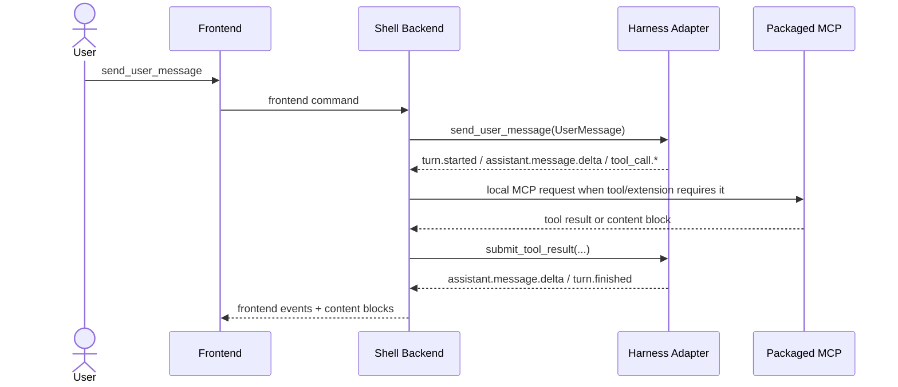

# Event Flow

> What this is: the runtime narrative built on the normalized schema.
>
> What this is not: the detailed wire contract for the browser or relay.

Back up to [overview.md](./overview.md).

## 1. Turn Path

One V0 turn follows this path:

## 2. Shell Roles

| Component | Job |
|---|---|
| `FrontendTranslator` | rename-and-wrap only |
| `TurnOrchestrator` | owns one turn lifecycle and command correlation |
| `EventRouter` | fan-out to frontend, persistence, and relay sinks |
| `ToolExecutionCoordinator` | launches local packaged MCP calls and collects results |

The old overloaded router model is retired.

## 3. Interaction-Layer Flow

When a content block mounts an interaction-layer extension:

1. the frontend opens a relay channel for the block,
2. user interaction emits relay frames back to the shell,
3. the shell forwards those frames to the paired MCP,
4. the MCP may answer with new content blocks, tool results, or relay-only UI
   updates, and
5. only events marked agent-visible enter the main turn stream.

The browser never talks directly to the MCP process.

## 4. V0 Session Rules

- One active shell session per process.
- One controlling tab per session.
- A second tab may connect, but it is a **read-only observer**.
- If the controlling tab disconnects briefly, the shell may replay from its
  in-memory buffer.
- If replay is no longer possible, emit `session.resync_required` and mark the
  turn abandoned rather than inventing missing content.

This resolves the old two-tab contradiction by choosing a single rule.

## 5. Failure Handling

- Harness dies: emit `turn.error`, then `session.resync_required` if the session
  must be restarted.
- MCP dies: publish an error content block for the affected tool or extension;
  keep the shell alive.
- Relay frame rejected: emit relay-level error only; do not poison the entire
  turn unless the action was agent-visible and required.

## 6. Read Next

- [normalized-schema.md](./normalized-schema.md)
- [../extensions/relay-protocol.md](../extensions/relay-protocol.md)
- [../frontend/protocol.md](../frontend/protocol.md)
