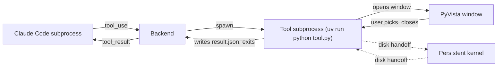
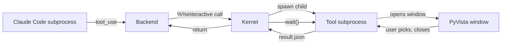
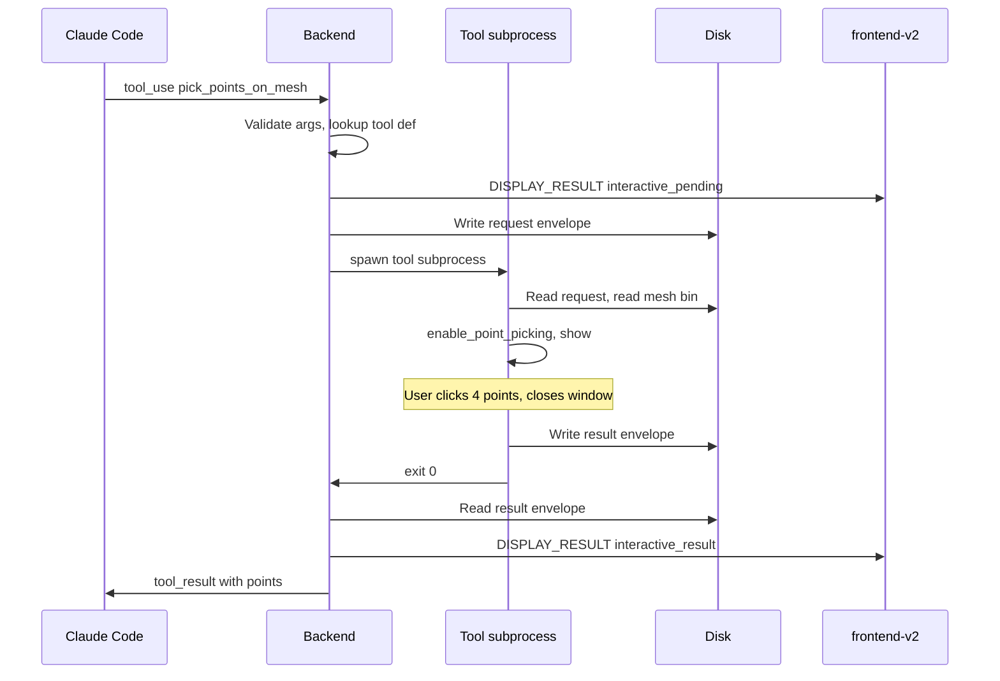

# Interactive Tool Protocol

> How the agent calls a **blocking interactive tool** (e.g. PyVista point
> picker), how the tool returns structured results to the agent, and how the
> protocol stays domain-neutral so a non-biomedical pivot ships new tools
> without touching the shell. This is the mechanism for **Decision 10's
> co-pilot Path B** — human-in-the-loop correction when the agent cannot
> determine something on its own.
>
> Read [overview.md](./overview.md) §3 (Interactive tool protocol),
> [agent-loading.md](./agent-loading.md), and
> [local-execution.md](./local-execution.md) before this doc — the protocol
> sits on top of those abstractions and only makes sense in their context.

## 1. Framing

### 1.1 The escape hatch model

The agent's normal mode is autonomous. It calls `python` and `bash` tools
against the persistent kernel, captures results to `.meridian/result.json`,
streams `DISPLAY_RESULT` back to Dad, and continues. **Most steps need no
human input.**

Some steps cannot be done blind. Landmark detection (validation step 6) is
the load-bearing example: even strong vision models cannot reliably click
the four points on a femur head that turn into a `W/L` ratio in the methods
section. The agent has two options:

- **Path A — self-feedback via vision.** Render off-screen, read the PNG
  back through its own multimodal channel, decide if the result is correct,
  iterate. This is just normal `python` tool use; the rendered PNG is a
  regular `DISPLAY_RESULT` image. It is **not** an interactive tool. §10
  spells this out; it's flagged here only to keep the two paths from being
  conflated.
- **Path B — human-in-the-loop interactive tool.** Open a window on Dad's
  desktop, let him click, return what he clicked. This is what this
  document describes.

An **interactive tool** is a tool the agent calls by name with JSON args,
which:

1. Opens a UI surface on the user's local machine (a window, a browser
   popup, a system dialog — the protocol does not care).
2. **Blocks** the agent's turn until the user completes the interaction or
   the tool times out / cancels.
3. Returns structured JSON to the agent via the harness's normal
   `tool_result` path.

The shell **does not know** the tool opens a PyVista window. It knows the
tool is registered as `kind: interactive`, knows its JSON schema, knows how
to spawn it, and knows how to receive its result. PyVista is an
implementation detail of one specific tool that ships with the biomedical
domain pack.

### 1.2 Why this is a separate protocol from `python`

A `python` tool call runs arbitrary code in the persistent kernel. We
*could* technically open a PyVista window from a `python` call, but it
would be wrong:

- **The kernel is not the right process for an event loop.** PyVista needs
  a Qt or VTK event loop. Hijacking the Jupyter kernel's main thread for it
  blocks all other kernel functionality and breaks `try/finally _flush()`
  semantics.
- **Schema and discoverability.** The agent should see "I have a tool
  called `pick_points_on_mesh` that takes a `mesh_id` and returns
  `{points: [[x,y,z], ...]}`" — not "I can write arbitrary code that may
  or may not block forever." Schema-typed tool definitions are how the
  model decides when to ask Dad for help.
- **UI signalling.** The shell needs to tell the frontend "user input
  required; PyVista window opened on your screen" while the tool runs. A
  raw `python` call has no place to hang that signal.
- **Cancellation.** The shell needs to be able to forcibly close the
  window if Dad clicks "cancel turn". An anonymous Python subprocess
  spawned from within kernel code is much harder to track than a tool
  invocation the backend launched itself.

So interactive tools are first-class. They live alongside `python` and
`bash` in the agent profile's tool list, register schemas with the harness,
and have their own execution path inside the backend.

## 2. Tool registration

### 2.1 Where tools live

Interactive tools ship with a domain pack, alongside the agent profile and
skills. They live in the `.agents/` tree that
[agent-loading.md](./agent-loading.md) describes:

```
.agents/
  agents/
    data-analyst.md            # agent profile (frontmatter + system prompt)
  skills/
    biomed-pipeline/SKILL.md   # biomedical skill
  tools/
    pyvista-pick-points/
      tool.yaml                # registration manifest
      tool.py                  # entry point (Python module)
      schema.json              # JSON Schema for args + result
      README.md                # human-facing docs
    pyvista-pick-box/
      tool.yaml
      ...
```

`tools/` is a new sibling of `agents/` and `skills/` in the mars-managed
package layout. Mars sync materializes it the same way it materializes
skills. Everything under `.agents/tools/` is generated; the source lives in
`meridian-base/tools/` or in a domain-specific package
(`meridian-biomed/tools/`).

### 2.2 The `tool.yaml` manifest

```yaml
# .agents/tools/pyvista-pick-points/tool.yaml
name: pick_points_on_mesh
kind: interactive            # vs. "python", "bash" — controls execution path
description: |
  Open a PyVista window showing the named mesh, let the user pick N points
  on its surface, return the picked coordinates. Use when you need
  anatomical landmarks the model cannot determine autonomously.

entry:
  type: python
  module: tool                # resolves to tool.py
  callable: run               # def run(args: dict, ctx: ToolContext) -> dict

requires:
  display: true               # needs a desktop display (X / Wayland / macOS)
  packages:                   # checked at registration time
    - pyvista>=0.43
    - vtk

schema_file: schema.json      # JSON Schema with args / result

# Optional defaults the registry layers in
defaults:
  timeout_seconds: 600        # tool is killed after 10 minutes idle
  cancel_on_turn_cancel: true # user clicks "cancel turn" → SIGTERM the tool

# What the frontend should show while this tool is blocking the turn
ui_hint:
  title: "Pick points on mesh"
  blocking_message: "PyVista window opened on your desktop — pick the requested points and close the window when done."
  icon: "crosshair"
```

**Why YAML, not Python decorators?** YAML can be inspected without
importing — the registry can list available tools, validate schemas, and
check `requires.display` / `requires.packages` without ever running domain
code. Decorator-based registration would force the backend to import every
tool at startup just to know what exists, which couples startup latency to
the slowest domain pack and surfaces import errors as registry failures.

### 2.3 The JSON Schema file

```json
// .agents/tools/pyvista-pick-points/schema.json
{
  "$schema": "https://json-schema.org/draft/2020-12/schema",
  "title": "pick_points_on_mesh",
  "args": {
    "type": "object",
    "required": ["mesh_id", "n_points"],
    "properties": {
      "mesh_id": {
        "type": "string",
        "description": "ID of a mesh previously published via show_mesh()."
      },
      "n_points": {
        "type": "integer",
        "minimum": 1,
        "maximum": 32,
        "description": "How many points the user must pick before the window closes."
      },
      "labels": {
        "type": "array",
        "items": { "type": "string" },
        "description": "Optional labels shown next to each point slot (e.g. ['lateral epicondyle', 'medial epicondyle'])."
      }
    }
  },
  "result": {
    "type": "object",
    "required": ["points"],
    "properties": {
      "points": {
        "type": "array",
        "items": {
          "type": "array",
          "items": { "type": "number" },
          "minItems": 3,
          "maxItems": 3
        }
      },
      "labels": { "type": "array", "items": { "type": "string" } },
      "mesh_id": { "type": "string" }
    }
  }
}
```

### 2.4 The `InteractiveToolRegistry`

At backend startup, the `InteractiveToolRegistry` walks `.agents/tools/`,
parses every `tool.yaml`, validates the schema, and builds an in-memory
table:

```python
@dataclass(frozen=True)
class InteractiveToolDef:
    name: str                  # "pick_points_on_mesh"
    description: str
    schema: dict               # JSON Schema (args + result)
    entry_module: str          # absolute import path under .agents/tools/...
    entry_callable: str        # "run"
    requires_display: bool
    required_packages: tuple[str, ...]
    timeout_seconds: int
    cancel_on_turn_cancel: bool
    ui_hint: dict

class InteractiveToolRegistry:
    def list(self) -> list[InteractiveToolDef]: ...
    def get(self, name: str) -> InteractiveToolDef | None: ...
    def schemas_for_harness(self) -> list[ToolDefinition]:
        """Return harness-formatted tool definitions for session start."""
```

`schemas_for_harness()` returns tool definitions in whatever shape the
active `HarnessAdapter` wants — Claude Code's `customTools` format, or
opencode's session-creation `tools` array (V1). The translation layer is
inside the adapter, not the registry, per the OCP commitment in
[harness-abstraction.md](./harness-abstraction.md).

### 2.5 Surfacing tools to the agent at session start

The `AgentLoader` (see [agent-loading.md](./agent-loading.md)) is responsible
for "what does the model see at the beginning of a session." It already
loads the profile, skills, and system-prompt fragments. Interactive tools
are one more category it pulls in:

```python
def build_session_context(profile_id: str) -> SessionContext:
    profile = catalog.load_agent(profile_id)        # data-analyst
    skills  = catalog.load_skills(profile.skills)   # biomed-pipeline, ...
    tools   = registry.list()                        # interactive tool defs
    return SessionContext(
        profile=profile,
        skills=skills,
        builtin_tools=("python", "bash", "str_replace_based_edit_tool"),
        interactive_tools=tools,
    )
```

The `HarnessAdapter` consumes `SessionContext` and turns
`interactive_tools` into harness-native tool definitions. The agent profile
itself does not need to enumerate which interactive tools exist — they are
discovered at runtime from the package, which is what makes the mars sync
+ "drop a new domain pack" workflow work.

## 3. Invocation model

This is the most consequential decision in this doc. Three options were
on the table; one wins.

### 3.1 Option A — run inside the persistent kernel


- **Pros**: mesh data already in kernel memory; zero IPC; trivially shares
  state with prior `python` calls.
- **Cons**: PyVista needs its own event loop. Hijacking the kernel's main
  thread for it freezes the kernel. The kernel can't service `_flush()` or
  any concurrent message during the wait. Stdout/stderr redirection (the
  kernel wrapper captures both) breaks for the GUI subprocess. PyVista
  windows opened from inside Jupyter often crash on macOS due to main-loop
  issues. Cancellation requires intrusive thread surgery on the kernel.

**Rejected.** Coupling GUI lifecycle to the kernel's event loop is the
single most common failure mode in scientific Python; we should not build
the protocol on top of it.

### 3.2 Option B — run in a fresh subprocess spawned by the backend



- **Pros**: full isolation, own event loop, own packages, easy
  cancellation (`SIGTERM` the subprocess), tool can crash without taking
  the kernel down.
- **Cons**: needs to fetch mesh data from the kernel out-of-band (mesh
  isn't in the new process's memory). Solved by writing meshes to disk
  (which we already do — see §8 below — `show_mesh()` already drops a
  binary file under
  `$MERIDIAN_WORK_DIR/.meridian/turns/<turn_id>/cells/<cell_id>/meshes/{mesh_id}.bin`).

**This is the chosen design.** Specifically: the backend spawns the tool
as `uv run --project <venv> python -m <tool_module>`, passing liveness over
stdin/stdout but using files as the load-bearing contract. The tool reads mesh
data from the canonical work-item handoff directory the kernel already
populates.

### 3.3 Option C — kernel-side helper that spawns a child process



- **Pros**: kernel controls lifetime, in-memory state stays nearby, child
  can be a subprocess.
- **Cons**: now there are *three* processes for one tool call (Claude Code
  → kernel → child). Cancellation has to walk the chain. The kernel still
  blocks on `wait()`, so it cannot service anything else. We get the worst
  of both A and B.

**Rejected.** Adds complexity without solving anything Option B doesn't
already solve.

### 3.4 Chosen: Option B with disk-handoff for state

The full flow:



The backend has an `InteractiveToolRunner` that owns the lifecycle. It is
the only place where interactive-tool subprocesses exist. The kernel never
sees them.

Mesh and related state are handed off through files under
`<work-item>/.meridian/interactive_inputs/<tool_call_id>/`. The kernel writes
the request envelope plus any referenced mesh/volume sidecars there before the
tool subprocess starts. The tool writes its result to the matching
`interactive_results/<tool_call_id>.json`. This is the explicit V0 contract.

Why disk handoff (rather than passing args via stdin and reading result from
stdout):

- The result envelope sometimes contains big data (e.g. a downsampled
  mesh slice). Stdout streaming forces the subprocess to coordinate with
  the backend's reader; disk handoff makes the protocol idempotent and
  re-readable on backend restart.
- Files-as-authority discipline (Decision 9). The interactive tool's
  request and result become part of the audit trail for free, and the
  user can re-open the same window with the same request later by
  replaying the file.

We *also* connect stdin/stdout for liveness signalling (heartbeat lines,
"window opened" notification, progress text), but the load-bearing
contract is the file pair, not the pipe.

## 4. Blocking semantics

While the tool subprocess runs, the agent's turn is paused **at the harness
level**: Claude Code is still running, the WebSocket subscription is still
open, but the model is waiting on the `tool_result` for the interactive
call. No other tool calls happen on this turn until the interactive one
returns.

The backend's job during the wait:

1. **Tell the frontend.** Emit `DISPLAY_RESULT` with
   `resultKind: "interactive_pending"` and the `ui_hint.blocking_message`
   from the tool manifest. The activity stream renders this as a callout
   block ("⏸ User input required — PyVista window opened on your
   desktop"). The existing AG-UI reducer already handles
   `DISPLAY_RESULT`; this is just a new `resultKind`, no reducer changes.
2. **Watch the subprocess.** Read its stdout heartbeat, watch its exit
   status, enforce the timeout.
3. **Forward cancellation.** If the user clicks "cancel turn" in the
   frontend, the backend calls `interrupt()` on the runner, which `SIGTERM`s
   the tool subprocess, then sends a `TOOL_CALL_RESULT` with an error
   payload back to the harness so the agent's turn unwinds cleanly.
4. **Stay event-loop healthy.** The backend itself does not block — the
   runner uses `asyncio.create_subprocess_exec` and the main loop keeps
   serving WebSocket frames, other sessions, etc.

When the tool subprocess exits, the runner reads the result file, builds
the `tool_result` payload, and writes it back through the harness adapter's
`HarnessSender.submit_tool_result(tool_call_id, result_or_error, status=...)`
(V0 — more on
how this maps to Claude Code's stream-json shape in
[harness-abstraction.md](./harness-abstraction.md)). The agent then resumes
on its next turn loop.

Single-tool-at-a-time per session is enforced: see §11.

## 5. Timeouts and cancellation

| Path | Trigger | Backend behavior |
|---|---|---|
| Normal completion | Tool subprocess exits 0 with valid result file | Read result, emit `tool_result`, continue turn |
| User declines | User closes window without picking enough points; tool exits with `{"error": "cancelled_by_user", ...}` | Treat as a normal `tool_result` whose body is the structured error; agent decides what to do (typically retries with different prompt or asks Dad in chat) |
| Hard error inside tool | Tool exits non-zero or result file missing or invalid | Build a `tool_result` with `{"error": "tool_failed", "stderr": "<tail>", "exit_code": N}`, emit it; agent sees a real failure |
| Idle timeout | `defaults.timeout_seconds` elapsed since spawn (or since last heartbeat — whichever the tool author chose) | Backend `SIGTERM`s subprocess, waits 5s, `SIGKILL`s if still alive, emits `tool_result` with `{"error": "timeout"}` |
| Turn cancellation | User clicks "cancel turn" in frontend (sends `control` envelope `op: cancel`) | Backend calls `runner.cancel(call_id)`, which `SIGTERM`s tool subprocess; result is `{"error": "cancelled_by_turn_cancel"}`; backend forwards turn cancel to harness adapter so the entire turn unwinds |
| Backend restart | Backend dies while window is open | Tool subprocess is orphaned and continues; on backend restart, reconciliation reads `interactive_inputs/` and `interactive_results/` and detects the orphan; the abandoned tool's `tool_result` cannot be delivered (the harness session is gone), so the backend records the orphan in the work-item decision log and skips it |
| Window crash | PyVista crashes the subprocess | `SIGCHLD` → exit non-zero → "Hard error inside tool" path |

**Default timeout is 10 minutes**, set per-tool in `tool.yaml` and
overridable per-call via an optional `timeout_seconds` field in the request
envelope (the agent can ask for a longer timeout if it knows it's a hard
landmark task).

**No infinite waits.** Even if the tool author writes `timeout_seconds:
0`, the registry clamps to a hard ceiling (e.g. 30 minutes) so a runaway
window cannot wedge a session forever. Dad needs to be able to walk away
and come back to a backend that has not deadlocked.

**Cancellation is cooperative-first, then forced.** Step 1: write a
cancel sentinel to `interactive_inputs/{call_id}.cancel`; the tool's main
loop should poll this and close the window cleanly. Step 2 (after 2s):
`SIGTERM`. Step 3 (after 5s): `SIGKILL`. PyVista respects signals; this
sequence has been validated in similar harnesses.

## 6. Result envelope shape

Every interactive tool returns the same envelope:

```json
{
  "schema_version": 1,
  "tool": "pick_points_on_mesh",
  "tool_call_id": "tc_01HXY...",
  "status": "ok",
  "result": {
    "points": [
      [12.4, 8.7, 22.1],
      [13.1, 9.0, 21.8],
      [11.9, 10.2, 23.0],
      [12.0, 11.0, 20.5]
    ],
    "labels": ["lateral_epicondyle", "medial_epicondyle", "trochlear_groove", "intercondylar_notch"],
    "mesh_id": "femur_seg_v1"
  },
  "meta": {
    "started_at": "2026-04-08T14:22:01Z",
    "ended_at":   "2026-04-08T14:23:47Z",
    "user_action": "completed_normally"
  }
}
```

Error envelope:

```json
{
  "schema_version": 1,
  "tool": "pick_points_on_mesh",
  "tool_call_id": "tc_01HXY...",
  "status": "error",
  "error": {
    "kind": "cancelled_by_user",
    "message": "User closed window after picking 2/4 points.",
    "partial": { "points": [[12.4, 8.7, 22.1], [13.1, 9.0, 21.8]] }
  },
  "meta": { "started_at": "...", "ended_at": "..." }
}
```

The agent always sees a `tool_result` block; the body is the envelope's
`result` (on success) or a JSON-serialized `error` (on failure). Partial
results are surfaced under `error.partial` so the agent can decide whether
two landmarks is enough or whether to retry.

`status` is one of: `ok`, `error`, `cancelled`, `timeout`. The first
keeps the contract small (3 buckets) and the agent's reasoning simple.

## 7. Domain neutrality

The backend, the registry, the runner, the frontend renderer — none of
them mention PyVista. The shell sees:

- A tool name (string)
- A JSON Schema (validated, but otherwise opaque)
- An entry-point spec (`module:callable`)
- A `requires.display` flag, a `requires.packages` list
- A `ui_hint` block for frontend rendering
- A request envelope written to disk
- A result envelope read from disk

Pivoting to a writing-assistant domain ships:

- A `proofread-author` agent profile
- A set of writing skills
- An interactive tool `request_inline_edit_from_user(passage_id, prompt)`
  whose `tool.py` opens a small Tkinter dialog (or a localhost browser
  popup served by an embedded HTTP server) instead of a PyVista window;
  same envelope, same registry, same cancellation, same UI hint pattern

The shell still does not know what "passage" means. The frontend renders
the same `interactive_pending` callout. The runner manages the same
subprocess lifecycle. New domain, zero shell edits.

A non-display interactive tool (e.g. a CLI wizard, a system file picker
on macOS via `osascript`, a phone-pushed approval flow) just sets
`requires.display: false` and ships its own UI. The protocol does not care
*where* the human is; it cares that the tool blocks until they answer.

## 8. Coordination with the persistent kernel

The interactive tool runs in a separate subprocess. It cannot reach into
the kernel's memory. The protocol has to provide a clean way for the tool
to access the same data the kernel has been working with (and, in some
cases, to write data *back* into the kernel's view).

Mesh data is the main case. The biomedical-mvp `show_mesh()` helper
already writes a binary mesh file to
`$MERIDIAN_WORK_DIR/.meridian/turns/<turn_id>/cells/<cell_id>/meshes/{mesh_id}.bin`.
The picker subprocess reads the staged handoff from
`$MERIDIAN_WORK_DIR/.meridian/interactive_inputs/<tool_call_id>/{mesh_id}.bin`.
This is the contract:

- **Kernel writes mesh** → `show_mesh("femur_seg_v1", verts, faces)`
  serializes the mesh to
  `$MERIDIAN_WORK_DIR/.meridian/turns/<turn_id>/cells/<cell_id>/meshes/femur_seg_v1.bin`
  and emits
  `DISPLAY_RESULT` referencing `mesh_id`.
- **Interactive tool reads mesh** → tool subprocess opens
  `$MERIDIAN_WORK_DIR/.meridian/interactive_inputs/<tool_call_id>/femur_seg_v1.bin`,
  decodes it (the format is shared), loads it into PyVista. It does not
  need any access to the kernel.
- **Interactive tool writes coordinates back** → result envelope is
  written to `interactive_results/{call_id}.json`. The agent picks it up
  via `tool_result`. **The kernel does not automatically learn about the
  new points** — the agent must explicitly ask `python` to record them in
  a variable on its next call (e.g. `landmarks_femur = [...]`).

Why no implicit injection back into kernel state:

- It would couple the kernel to the interactive tool through a hidden
  side channel. The agent loses traceability ("where did `landmarks_femur`
  come from?").
- It defeats files-as-authority. The points should pass through the
  agent's reasoning loop, get logged in the activity stream, and be
  written into the work item explicitly.
- It is trivial for the agent to do the assignment itself in a one-line
  `python` call after the interactive tool returns.

For very large data the disk handoff is fine — `meshes/*.bin` is exactly
how the V0 frontend already streams meshes; we are reusing the channel.
For tools that need *kernel* state that does not have a file form (e.g.
"the current value of `selected_threshold`"), the agent must explicitly
serialize it to `interactive_inputs/` first. The protocol intentionally
does not auto-introspect kernel namespaces.

Filesystem layout under the work item:

```
.meridian/work/<work-id>/
  meshes/
    femur_seg_v1.bin             # produced by show_mesh()
  interactive_inputs/
    tc_01HXY/
      request.json               # request envelope
      mesh.bin                   # optional mesh handoff from kernel
      cancel                     # cancel sentinel (only if cancelled)
  interactive_results/
    tc_01HXY.json                # result envelope
```

`interactive_inputs/` and `interactive_results/` are new directories; they
become part of the audit trail and are git-ignored only if the user
chooses (Decision 9: scientific reproducibility wants them tracked).

## 9. Biomedical V0 tool inventory

These are the interactive tools the biomedical domain pack ships in V0.
Each is a single `.agents/tools/<dir>/` package with a `tool.yaml`,
`tool.py`, `schema.json`, and `README.md`.

### 9.1 `pick_points_on_mesh` — landmark picking

**Critical for validation step 6.** Opens a PyVista window, shows the
named mesh, enables `enable_point_picking()`, displays a counter ("3 of 4
picked"), closes when `n_points` are picked or the user closes the window.

```text
args:   { mesh_id: str, n_points: int (1..32), labels?: str[] }
result: { points: [[x,y,z], ...], labels: str[], mesh_id: str }
```

### 9.2 `pick_box_on_volume` — ROI selection on raw voxels

Opens a PyVista window showing a volume rendering of the raw voxel data,
enables `add_box_widget()`, returns the box bounds when the user closes
the window. Used for cropping a DICOM stack down to a single bone before
preprocessing.

```text
args:   { volume_id: str, initial_bounds?: [[xmin,ymin,zmin],[xmax,ymax,zmax]] }
result: { bounds: [[xmin,ymin,zmin],[xmax,ymax,zmax]], volume_id: str }
```

`volume_id` resolves the same way `mesh_id` does — through a
`$MERIDIAN_WORK_DIR/.meridian/interactive_inputs/<tool_call_id>/{volume_id}.npy`
(or `.nii.gz`) file the kernel writes via a sister `show_volume()`
helper. (`show_volume()` is a small extension to the existing
result-helper set; not shipped in the biomedical-mvp pivot but trivial to
add.)

### 9.3 `pick_threshold_on_histogram` — segmentation threshold tuning

Opens a window with a 1D histogram on the left and a 2D slice preview on
the right. A slider controls the threshold; the preview updates in real
time. User clicks "accept", window closes, returns the chosen threshold.

```text
args:   { volume_id: str, initial_threshold?: float, slice_axis?: "x"|"y"|"z" }
result: { threshold: float, volume_id: str }
```

This one is what makes Path B usable for segmentation: instead of the
agent guessing thresholds for watershed, Dad sees what each threshold
*does* before committing.

### 9.4 `orient_with_pca_preview` — PCA alignment review

Runs PCA on the named mesh in the kernel before opening (the kernel writes
the proposed rotation matrix into `interactive_inputs/`), then opens a
PyVista window showing the original orientation on the left and the
proposed orientation on the right. User accepts, rejects, or fine-tunes
with arrow keys. Returns the final rotation matrix.

```text
args:   { mesh_id: str, proposed_rotation: float[3][3] }
result: { rotation: float[3][3], accepted: bool, mesh_id: str }
```

This is the pattern for **agent-prepared / human-approved** corrections:
the heavy work (PCA) happens in the kernel; the interactive tool just
visualizes and confirms.

### 9.5 What's NOT in V0

- Multi-mesh side-by-side comparison tool (V1)
- Image-pair landmark correspondence tool (V1, when registration becomes
  a step)
- Brush-based segmentation correction (V1+; needs a proper paint widget)

Each of these is a **new tool package**, not a shell change.

## 10. Path A (vision-based self-feedback) is not an interactive tool

Path A is the agent rendering its own work and inspecting its own output.
Concretely:

1. Agent calls `python` tool → renders the current segmentation off-screen
   to `figures/femur_check_001.png` via PyVista's
   `Plotter(off_screen=True)` and `screenshot=...`.
2. Kernel's `show_image()` helper records the PNG path in
   `result.json` → backend emits `DISPLAY_RESULT` with
   `resultKind: "image"` → frontend renders the PNG inline (and Dad sees
   it too, so this is also free progress reporting).
3. The image is included in the agent's next message context as a
   multimodal attachment (Claude Code stream-json supports image inputs in
   `tool_result` blocks; the kernel wrapper packages the PNG bytes
   accordingly).
4. The agent reasons over its own image: "the femur is misaligned in the
   lateral view; rotating −15° around Z." It then issues a corrective
   `python` call.

This path uses **only** the existing `python` tool and the existing
`show_image` / `DISPLAY_RESULT` machinery. There is no new tool kind, no
window, no blocking, no user interaction. It is co-pilot Path A and it is
intentionally not an interactive tool because it does not need to be.

The contrast with Path B is the protocol's reason for existing: when the
agent cannot resolve a question by looking harder at its own output, it
escalates to an interactive tool, and Dad becomes the oracle.

Which path to take is **not shell state**. The shell has no "Path A mode" or
"Path B mode" toggle. The agent profile and biomedical skill instruct the
model to try Path A first and escalate to Path B only when confidence is low.

## 11. Edge cases

### 11.1 No display available (headless / SSH without X)

The runner checks `requires.display: true` against the host's available
display **at registration startup, not at call time**. If no display, the
tool is registered with a `disabled_reason` and the harness adapter
**does not surface it to the agent at all**. The agent never sees a tool
it cannot use.

If the agent asks for a tool that exists but is disabled (race against a
display going away mid-session), the runner returns
`{"status": "error", "error": {"kind": "no_display"}}` immediately and
the agent's prompt should explain that Path B is unavailable and Path A
must be used.

### 11.2 PyVista / dependencies missing

`requires.packages` is checked at registry build time via `importlib`.
Missing packages disable the tool with a clear `disabled_reason` so the
agent never sees a broken tool, and so Dad sees a clear error in the
backend startup log ("biomedical V0 cannot ship Path B until you `uv add
pyvista vtk`"). `meridian shell start` should fail loudly if a registered
domain tool's deps are missing — silently dropping the tool is worse than
crashing.

### 11.3 Multiple interactive tools in one turn

Allowed but **serialized**. The runner enforces a per-session lock: only
one interactive tool window at a time. If the agent issues two
interactive tool calls in the same turn (rare but possible), the second
queues until the first returns. The agent sees a normal blocking call;
the user sees one window at a time.

### 11.4 Agent calls an interactive tool while one is already open

Different session: run normally (the lock is per session, not global —
single user, but the architecture allows multiple work items open in
different tabs).

Same session, parallel tool calls inside one turn: should be impossible
because the harness yields the turn until the tool result returns. If
some adapter quirk lets it happen, the runner queues the second call as
above.

### 11.5 Backend restart while window is open

- Tool subprocess is orphaned. It is **not** a child of the backend
  process tree — it is a child of the user's session via the
  `Plotter.show()` GUI process — so it survives. PyVista keeps the window
  up.
- On restart the backend reconciles `interactive_inputs/` against
  `interactive_results/`. Any input without a matching result and without
  a live subprocess (checked via PID file written at spawn time) is
  marked as an orphan in the work-item decision log.
- The harness session is gone, so the orphan's eventual result cannot be
  delivered to the agent. The decision log entry says "this is what the
  user picked, but the agent never received it; if you want, ask the
  agent to re-run with these coordinates."
- **No automatic recovery.** The protocol intentionally does not try to
  resume a dead session through a survived subprocess. Backend restarts
  during interactive tool calls are rare; rebuilding the entire session
  for them would dwarf the cost of just asking Dad to redo the click.
  (Session persistence in general is V1; see Q2.)

### 11.6 Tool subprocess crashes

`SIGCHLD`, exit non-zero, no result file → "Hard error inside tool" path
in §5. Stderr tail goes into the error envelope. Agent sees a structured
failure, decides whether to retry, ask Dad in chat, or fall back to Path A.

### 11.7 Tool returns invalid result envelope

Backend validates the result envelope against the tool's `schema.json`
before forwarding. Validation failure is a tool bug, not a user error;
treated as `kind: "tool_failed"` with the validation error in `message`.
This protects the agent from being fed garbage that looks like success.

### 11.8 User picks fewer points than `n_points` and closes the window

PyVista has no built-in "must pick N before close." The tool wraps
`enable_point_picking()` with a callback that increments a counter; if
the user closes early, the tool returns
`status: "cancelled", error.kind: "cancelled_by_user"` with the partial
points. The agent then decides — usually "ask Dad in chat what's wrong."

### 11.9 Display scaling, multiple monitors, focus stealing

PyVista on Linux/macOS sometimes opens off-screen on multi-monitor
setups. The tool `tool.py` should call `plotter.window_size = (1280,
800)` and `plotter.show(auto_close=False, interactive_update=True)` to
get a predictable window. This is tool-author concern, not protocol
concern, but the V0 PyVista tools must all do it consistently.

### 11.10 Cancellation race: user closes window the same instant timeout fires

Both code paths build a result envelope; whichever completes first wins;
the second is dropped on read. The result envelope file is written
atomically (tmp + rename) so there is no partial file.

## 12. Open questions for follow-up

These are not blockers for V0 but should be tracked.

- **Should the `interactive_pending` callout in the frontend be
  click-cancellable?** Right now cancel goes through the existing "cancel
  turn" affordance. A dedicated "close this tool" button would be nicer
  but adds frontend work.
- **Does the tool subprocess need access to the session's environment
  variables / cwd?** The spawn currently inherits backend env. If a tool
  needs the work-item directory it gets it via the request envelope, not
  the env, to keep the contract explicit.
- **Should `tool.yaml` support a `kind: interactive_browser` variant**
  that opens an OS browser tab to a backend-served URL instead of
  spawning a subprocess? That would let writing-domain tools ship
  HTML/JS UIs without packaging Tkinter. Scoped to V1.
- **How does this protocol interact with permission gating** (Q2)? An
  interactive tool is, by construction, user-approved at the moment of
  use; should it bypass permission gating entirely, or should the
  permission system see it as "agent requested an interactive tool"?
  Defer to V1 when permission gating ships.

## 13. Cross-references

- [overview.md](./overview.md) §3 — where this protocol sits in the
  system topology
- [agent-loading.md](./agent-loading.md) — how `SessionContext` materializes
  interactive tool definitions for the harness
- [harness-abstraction.md](./harness-abstraction.md) — how
  `HarnessSender.send_tool_result` receives the result envelope
- [local-execution.md](./local-execution.md) — the persistent kernel and
  the disk handoff conventions (`meshes/`, `volumes/`)
- [frontend-protocol.md](./frontend-protocol.md) — `DISPLAY_RESULT`
  envelope, the `resultKind: "interactive_pending"` extension
- [event-flow.md](./event-flow.md) — end-to-end choreography including
  the interactive tool path
- requirements.md Decision 6, Decision 10, validation step 6

## 14. Customer reminder

Dad needs to be able to click four points on a femur, see the agent take
those points and turn them into a publication-quality W/L ratio, and
trust that the methods section reflects exactly what happened. This
protocol exists so that "click four points" is the entire user
experience, the rest is automatic, and the audit trail is complete. If
any decision in this doc makes that harder, it is wrong.
