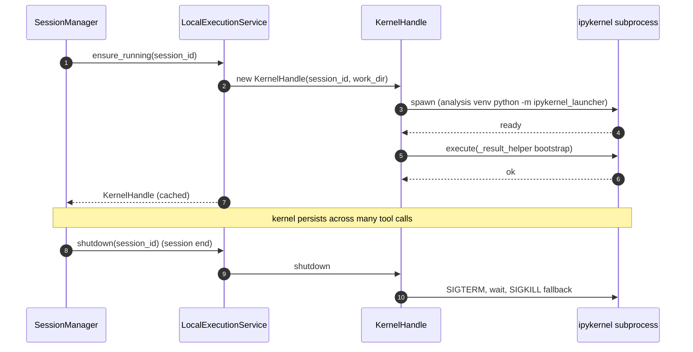

# Local Execution Runtime

> The agent's `python` and `bash` tools resolve to a **local uv-managed venv**
> with a **persistent Jupyter kernel** as the execution surface for Python.
> This doc is the V0 replacement for biomedical-mvp's `daytona-service`: same
> API shape, same `result_helper` capture protocol, but everything runs as
> ordinary local processes against the user's filesystem. No cloud, no
> sandbox, no isolation.
>
> Read [overview.md](./overview.md) first. This doc owns §3 "Local execution
> runtime" of that map. Sibling docs that touch this surface:
> [interactive-tool-protocol.md](./interactive-tool-protocol.md),
> [event-flow.md](./event-flow.md),
> [agent-loading.md](./agent-loading.md),
> [repository-layout.md](./repository-layout.md).

## 1. Framing — `LocalExecutionService` is the V0 `daytona-service`

The biomedical-mvp pivot defined a `daytona-service` interface that the Python
backend called whenever the agent needed to run code. Its surface is small:

```
EnsureRunning(session_id) -> KernelHandle
ExecInKernel(session_id, code) -> stream(stdout) -> result.json
ExecBash(session_id, cmd, cwd) -> stream(stdout, stderr, exit_code)
StageFiles(session_id, files) -> manifest
```

V0 keeps that exact shape and reimplements it as `LocalExecutionService`. The
two implementations are interchangeable behind a `ExecutionBackend` interface
so V1 can swap in Daytona, a remote sandbox, or a per-machine container
without touching the harness adapter, the translator, or the activity-stream
event flow.

```python
# src/meridian/shell/exec/backend.py
class ExecutionBackend(Protocol):
    async def ensure_running(self, session_id: str) -> "KernelHandle": ...
    async def exec_in_kernel(
        self, session_id: str, code: str, *, turn_id: str, cell_id: str
    ) -> AsyncIterator["KernelEvent"]: ...
    async def exec_bash(
        self, session_id: str, cmd: str, *, cwd: Path, turn_id: str
    ) -> AsyncIterator["BashEvent"]: ...
    async def stage_files(
        self, session_id: str, files: Sequence[Path]
    ) -> "StageManifest": ...
    async def shutdown(self, session_id: str) -> None: ...
```

`LocalExecutionService` is the V0 implementation. The harness adapter never
imports it directly — it goes through the protocol, so the OCP commitment in
[overview.md](./overview.md) §5 holds for the execution surface as well as the
harness surface.

The mental model for the rest of this doc: **everything Daytona did remotely
in the biomedical-mvp pivot, this service does locally.** Where that mapping
is exact, we say so. Where it diverges, we call it out.

## 2. Venv model — global shared domain venv

### The choice

V0 uses **one global biomedical analysis venv** managed by uv, shared across
all work items but **separate from** the meridian-channel project venv.

```
~/.meridian/venvs/biomedical/
├── .python-version              # pinned by `meridian shell init biomedical`
├── biomedical.toml              # copied from the runtime manifest
├── uv.lock                      # reproducible lock
└── .venv/
    ├── bin/python
    ├── bin/jupyter
    └── lib/python3.12/site-packages/...
```

Resolution is via a small helper, not via shell activation:

```python
# src/meridian/shell/runtime/venv.py
ANALYSIS_VENV = Path(
    os.environ.get("MERIDIAN_BIOMEDICAL_VENV")
    or Path.home() / ".meridian/venvs/biomedical"
)

def analysis_python() -> Path:
    return ANALYSIS_VENV / ".venv/bin/python"

def ensure_analysis_venv() -> None:
    if (ANALYSIS_VENV / ".venv/bin/python").exists():
        return
    subprocess.run(
        ["uv", "sync", "--frozen"],
        cwd=ANALYSIS_VENV,
        check=True,
    )
```

### Why not the alternatives

| Option | Pros | Cons | V0? |
|---|---|---|---|
| **A. Global shared venv** | Fast cold start, one `uv sync`, one place to update SimpleITK, mesh import cache hot across work items | All work items share package versions; one bad upgrade breaks everything | **Yes** |
| B. Per-work-item venv | Reproducible per project, each item is a sealed methods section | First-run cost is 30–90s of `uv sync`, 4–6 GB per item, redundant | No (V1 candidate) |
| C. Hybrid | Best of both | Two failure modes, two upgrade paths, two doc surfaces | No |

The decisive constraint is Dad's experience. He uses Amira because reaching
"loaded my data and ran a step" is fast. A 60s wait the first time he opens a
new work item teaches him the tool is slow. The cost is paid once, at domain
init time, not per work item and not in the core project environment.

### Migration path to per-work-item

When (not if) reproducibility forces per-work-item venvs, the upgrade is
local: introduce a `WorkItemVenvBackend` that implements the same
`ExecutionBackend` protocol, resolves `analysis_python()` per
`session_id → work_item_id → venv`, and pin a `pyproject.toml` snapshot into
`<work-item>/.meridian/venv/` at session start. The kernel-launch and
`result_helper` paths do not change.

## 3. Package installation — bootstrapped at install, refreshed on demand

### Prerequisite (user-installed, one time)

`README.md` quickstart says: install Python 3.12+ and `uv`. That's it. The
existing Decision 7 in [requirements.md](../requirements.md) green-lights this
because Python is required for analysis anyway.

### `meridian shell init biomedical` (one time, automated)

```bash
$ meridian shell init biomedical
[shell] Creating analysis venv at ~/.meridian/venvs/biomedical ...
[shell] Resolving dependencies (this can take a minute) ...
[shell] Installed: SimpleITK 2.4.0, scipy 1.13, numpy 2.0, pandas 2.2,
        scikit-image 0.24, plotly 5.24, matplotlib 3.9, pydicom 3.0,
        trimesh 4.4, pyvista 0.44, jupyter_client 8.6, ipykernel 6.29
[shell] Analysis venv ready.
```

The pinned manifest ships in this repo at
`src/meridian/shell/runtime/manifests/biomedical.toml` and is **copied** to
the user's data dir on first init. Updates are explicit:

```bash
$ meridian shell venv upgrade biomedical
$ meridian shell venv add biomedical napari
$ meridian shell venv list biomedical
$ meridian shell venv reset biomedical
```

### Package set (V0)

The pinned manifest:

```toml
[project]
name = "meridian-biomedical-runtime"
version = "0.0.0"
requires-python = ">=3.12"
dependencies = [
  # imaging + DICOM
  "SimpleITK>=2.4",
  "pydicom>=3.0",
  "scikit-image>=0.24",
  # numerics + dataframes
  "numpy>=2.0",
  "scipy>=1.13",
  "pandas>=2.2",
  # plotting
  "plotly>=5.24",
  "matplotlib>=3.9",
  # mesh + 3D
  "trimesh>=4.4",
  "pyvista>=0.44",
  "vtk>=9.3",
  # kernel substrate
  "ipykernel>=6.29",
  "jupyter_client>=8.6",
]
```

### What is NOT in the analysis venv

The FastAPI backend, the harness adapter, and the meridian CLI itself live in
**meridian-channel's own venv** (the project's root environment). The
biomedical analysis venv is purely for code the agent runs. Keeping these
separate matters because:

- The backend can ship type-checked dependencies without dragging in a 4 GB
  PyVista/VTK install for users who never touch biomedical work.
- The agent can `uv pip install` into the analysis venv at runtime without
  risking the backend's import graph.
- A broken analysis venv does not take down the shell; it surfaces as a
  visible "analysis venv unavailable" error in the UI.

## 4. Kernel lifecycle — `jupyter_client` over an `ipykernel` subprocess

### The choice

V0 uses **`jupyter_client.AsyncKernelClient` driving an `ipykernel`
subprocess** running the analysis venv's Python. Concretely:

```python
# src/meridian/shell/exec/kernel.py
from jupyter_client.manager import AsyncKernelManager

class KernelHandle:
    def __init__(self, session_id: str, work_dir: Path):
        self.session_id = session_id
        self.work_dir = work_dir
        self.km: AsyncKernelManager | None = None
        self.kc: "AsyncKernelClient | None" = None

    async def start(self) -> None:
        self.km = AsyncKernelManager(
            kernel_name="python3",
            kernel_cmd=[
                str(analysis_python()), "-m", "ipykernel_launcher",
                "-f", "{connection_file}",
            ],
        )
        await self.km.start_kernel(cwd=str(self.work_dir))
        self.kc = self.km.client()
        self.kc.start_channels()
        await self.kc.wait_for_ready(timeout=20)
        await self._inject_result_helper()

    async def shutdown(self) -> None:
        if self.kc: self.kc.stop_channels()
        if self.km: await self.km.shutdown_kernel(now=True)
```

### Why `jupyter_client` and not the alternatives

| Option | Why considered | Why rejected (or accepted) |
|---|---|---|
| **`jupyter_client` over `ipykernel`** | Battle-tested ZMQ/Jupyter protocol; native streaming stdout, stderr, display_data, error; reliable interrupt and shutdown; reused by biomedical-mvp's design | **Chosen.** Known protocol, the heavy lifting is done. |
| Plain subprocess + stdin/stdout REPL | Simpler dependencies | No structured streaming, no rich display, no clean interrupt, no traceback shape. We would re-implement Jupyter badly. |
| `IPython.terminal.embed` in-process | Zero IPC | Kernel state would live in the FastAPI process — one bad import takes down the backend. Hard NO. |
| `ipyparallel` / Dask | Multi-worker | Solves a problem we don't have. |

The **kernel runs in its own process**, isolated from the FastAPI backend, so
import errors, segfaults in VTK, and runaway loops can be killed without
killing the shell. This is the same isolation property Daytona gave us for
free; we re-create it locally with a subprocess boundary.

### Lifecycle



One kernel per session. Cached in `LocalExecutionService` keyed by
`session_id`. Created lazily on first `python` tool call (not on session
start) so non-Python sessions don't pay the cost.

## 5. ExecInKernel — how a `python` tool call becomes a kernel execution

### Inbound shape

When the harness adapter routes a `python` tool call, it lands in the
backend's tool router as:

```python
ToolCall(
    name="python",
    args={"code": "<source>"},
    tool_call_id="toolu_...",
    turn_id="t_42",
)
```

The backend dispatches to `LocalExecutionService.exec_in_kernel(...)`.

### What runs

The wrapper does **not** just send raw user code. It wraps the code in a
try/finally that flushes results even on exceptions, mirroring the
biomed-mvp `result_helper` protocol exactly:

```python
WRAPPED = """\
import _meridian_result_helper as _rh
_rh._begin(cell_id={cell_id!r}, turn_id={turn_id!r})
try:
{indented_user_code}
finally:
    _rh._flush()
"""
```

`{indented_user_code}` is the agent's code with each line prefixed by four
spaces. `_rh._begin` clears any prior `result.json` for this cell; `_rh._flush`
serializes any accumulated `show_*` calls to disk **before** the kernel sends
its `execute_reply`.

### Streaming back out

The wrapper consumes Jupyter messages from the iopub channel and translates
them into a `KernelEvent` stream that the harness adapter forwards as the
biomed-mvp `TOOL_OUTPUT` / `DISPLAY_RESULT` events ([event-flow.md](./event-flow.md)
owns the full event mapping). The mapping is:

| Jupyter `msg_type` | KernelEvent | AG-UI event |
|---|---|---|
| `stream` (stdout) | `KernelStdout(text)` | `TOOL_OUTPUT(stream="stdout")` |
| `stream` (stderr) | `KernelStderr(text)` | `TOOL_OUTPUT(stream="stderr")` |
| `display_data` / `execute_result` | (ignored — we use file capture) | — |
| `error` | `KernelError(ename, evalue, traceback)` | `TOOL_OUTPUT(stream="stderr")` + `TOOL_CALL_RESULT(error=...)` |
| `status: idle` | `KernelDone()` | triggers `DISPLAY_RESULT` emission |

After `KernelDone`, the service reads `<work_item>/.meridian/turns/<turn_id>/cells/<cell_id>/result.json`,
parses any `show_*` payloads, and emits one `DISPLAY_RESULT` per entry plus
binary mesh frames (see §6 and [event-flow.md](./event-flow.md)).

### Concurrency

A kernel is single-threaded. Two concurrent `python` tool calls in the same
session would deadlock the iopub stream interpretation. The service serializes
`exec_in_kernel` calls per session via an `asyncio.Lock` held inside the
`KernelHandle`. The harness only ever issues one tool call at a time per
session in V0, so this lock is a safety belt, not a contention point.

### Quoting the biomed-mvp shape (continuity)

This is intentionally identical to biomed-mvp's `daytona-service.ExecInKernel`
contract — same wrapper, same flush semantics, same `result.json` location,
same idempotency guarantees on partial failure. The only thing that changes
is the kernel's process boundary (local subprocess vs. remote Daytona kernel
gateway). That continuity is the whole point: the biomed-mvp protocol design
work doesn't get re-litigated.

## 6. `result_helper` injection — bootstrap a helper module into kernel namespace

### Where the module lives

A real, importable Python file ships in this repo at
`src/meridian/shell/exec/result_helper/_meridian_result_helper.py`. It is
**not** copied into the analysis venv's site-packages. Instead, the kernel
launch sets `PYTHONPATH` to include the directory containing the module:

```python
env = os.environ.copy()
helper_dir = Path(__file__).parent / "result_helper"
env["PYTHONPATH"] = f"{helper_dir}{os.pathsep}{env.get('PYTHONPATH', '')}"
env["MERIDIAN_WORK_DIR"] = str(self.work_dir)
env["MERIDIAN_SESSION_ID"] = self.session_id
self.km.kernel_spec.env.update(env)
```

The module shape mirrors biomed-mvp:

```python
# _meridian_result_helper.py (sketch)
import json, os, uuid
from pathlib import Path

_STATE = {"cell_id": None, "turn_id": None, "items": []}

def _result_dir() -> Path:
    work = Path(os.environ["MERIDIAN_WORK_DIR"])
    d = work / ".meridian/turns" / _STATE["turn_id"] / "cells" / _STATE["cell_id"]
    d.mkdir(parents=True, exist_ok=True)
    return d

def _begin(cell_id: str, turn_id: str) -> None:
    _STATE.update(cell_id=cell_id, turn_id=turn_id, items=[])
    (_result_dir() / "result.json").unlink(missing_ok=True)

def _flush() -> None:
    out = _result_dir() / "result.json"
    tmp = out.with_suffix(".json.tmp")
    tmp.write_text(json.dumps({"items": _STATE["items"]}))
    tmp.replace(out)

def show_plotly(fig, *, title: str | None = None) -> None: ...
def show_matplotlib(fig, *, title: str | None = None) -> None: ...
def show_dataframe(df, *, max_rows: int = 200, title: str | None = None) -> None: ...
def show_mesh(mesh, *, mesh_id: str | None = None, title: str | None = None) -> None: ...
```

### Making the helpers feel built-in

The kernel bootstrap (after `wait_for_ready`) executes:

```python
import _meridian_result_helper as _rh
from _meridian_result_helper import (
    show_plotly, show_matplotlib, show_dataframe, show_mesh,
)
```

…so the agent writes `show_plotly(fig)` directly, no namespace prefix. This
matches the biomed-mvp data-analyst agent profile's expectations and means the
data-analyst skill prompts copy over with zero edits.

### Why not `IPython` startup scripts

`~/.ipython/profile_default/startup/*.py` would also work and is a fine
alternative. We avoid it because (a) it pollutes the user's IPython config,
(b) it's harder to version with the codebase, (c) it can't read
session-scoped env vars set at kernel launch. PYTHONPATH + explicit bootstrap
is more boring and more hermetic.

## 7. Working directory — drop `/workspace/`, use `MERIDIAN_WORK_DIR`

### The change

Biomed-mvp used `/workspace/` because Daytona mounted the project root there.
Locally there is no mount; the work item directory has a real path like
`/home/dad/.../meridian/work/yao-2026-01/`.

V0 uses **`MERIDIAN_WORK_DIR` as the canonical convention**. The kernel is
launched with:

- `cwd` = the work item directory
- env `MERIDIAN_WORK_DIR` = the same path (absolute)
- env `MERIDIAN_SESSION_ID` set
- env `MERIDIAN_TURN_ID` updated per turn (via a kernel exec) so helpers can
  default the turn dir without being told each cell

The data-analyst agent profile is updated to reference `MERIDIAN_WORK_DIR`
instead of `/workspace/`. This is a **one-line change in the system prompt**
shipped via the existing `.agents/` flow ([agent-loading.md](./agent-loading.md)).

### Why drop the alias

| Option | Pros | Cons |
|---|---|---|
| Keep `/workspace/` via symlink | Zero changes to biomed-mvp skills | Requires writing to `/`, breaks on Windows, surprising for users who `cd` into the dir from their shell |
| Drop `/workspace/`, use env var | Native to local FS, portable, no root perms, no surprise paths | Skills must be updated (one-line) |
| Both | Soft migration | Two ways to reference the same place — drift guaranteed |

We pick the env-var path. The skill update is trivial and the resulting
`MERIDIAN_WORK_DIR` story matches the rest of meridian-channel's existing
convention — `MERIDIAN_WORK_DIR`, `MERIDIAN_FS_DIR`, `MERIDIAN_STATE_ROOT` all
already exist in the CLI.

### What the agent sees

```python
import os
from pathlib import Path
WORK = Path(os.environ["MERIDIAN_WORK_DIR"])
raw  = WORK / "data/raw/femur_dicom"
out  = WORK / "data/interim/femur_seg.nii.gz"
```

Skills that previously said `/workspace/data/raw/...` are rewritten as
`$MERIDIAN_WORK_DIR/data/raw/...`. The data-analyst agent profile gets a top
note: "Always read/write under `$MERIDIAN_WORK_DIR`. Never use absolute paths
outside it."

## 8. ExecBash — a sibling tool, not a kernel passenger

### The split

`bash` and `python` are **two separate execution surfaces**. They share a
working directory (the work item dir) but not state.

| | Python (`exec_in_kernel`) | Bash (`exec_bash`) |
|---|---|---|
| Process | Long-lived `ipykernel` subprocess | Fresh `subprocess.exec` per call |
| State across calls | Yes — variables, imports, loaded volumes | No — env, cwd reset each call |
| Streaming | Jupyter iopub → `TOOL_OUTPUT` | line-buffered stdout/stderr → `TOOL_OUTPUT` |
| Result capture | `result.json` via `result_helper` | exit code + stdout/stderr text only |
| Interruption | `KernelClient.interrupt()` (SIGINT to kernel) | SIGTERM → SIGKILL escalation |
| Lives in venv? | **Yes** — analysis venv's Python | **No** — host shell, host PATH |

### Why bash is not piped through the kernel

Sharing env with the kernel sounds nice ("the agent set `EXPORT FOO=bar`,
then python sees it"). In practice:

- The agent confuses the two surfaces; "I set it in bash, why doesn't python
  see it" is a worse failure mode than "they are separate, period."
- Jupyter kernels don't expose a clean shell-line execution channel; we'd be
  reinventing it.
- Bash needs a TTY-ish surface (color, line buffering, exit codes); Jupyter's
  `!cmd` syntax is a poor fit and binds bash semantics to ipykernel quirks.

So `exec_bash` is `asyncio.create_subprocess_exec("/bin/bash", "-c", cmd, cwd=work_dir, ...)`,
streams `stdout`/`stderr` line by line to `TOOL_OUTPUT`, and emits a
`TOOL_CALL_RESULT` with exit code at the end. The bash tool intentionally
does **not** activate the analysis venv. If the agent wants to call Python
from bash, it must spell out `$MERIDIAN_ANALYSIS_PYTHON path/to/script.py` —
the env var is exported into the bash process. This forces the agent to be
explicit about which Python it means.

### Bash environment

```
PATH=<host PATH>
HOME=<host HOME>
PWD=<work item dir>
MERIDIAN_WORK_DIR=<work item dir>
MERIDIAN_SESSION_ID=<session id>
MERIDIAN_ANALYSIS_PYTHON=<path to analysis venv python>
```

Anything else from the host environment is **passed through unchanged** in
V0. We are single-user local; the user's PATH is the user's PATH.

## 9. StageFiles — drop the upload pipeline; the work item dir is the staging area

### What biomed-mvp had

A full classify/presign/upload/finalize dance with TUS for big files,
manifest folders, dataset types, and an explicit `StageFiles` API that pushed
bytes from cloud storage into the Daytona sandbox at
`/workspace/data/raw/<name>/`. Many moving parts.

### What V0 has

**The work item directory IS the staging area.** There is no upload pipeline,
no presign, no manifest, no dataset classification.

```
.meridian/work/<work-item-id>/
├── data/
│   ├── raw/                # user drops files here
│   ├── interim/            # agent writes intermediates here
│   └── processed/          # agent writes final outputs here
├── .meridian/
│   ├── turns/              # per-turn audit trail (§13)
│   └── result.json         # current cell result (legacy alias, optional)
├── design/                 # if this is a meridian work item with planning
├── plan/
└── ...
```

### How files get in

Two paths, both trivial:

1. **Drag-drop in the frontend.** The browser uploads to the backend over
   the existing WebSocket / REST surface; the backend writes the bytes to
   `<work-item>/data/raw/<filename>/`. No classification, no manifest, no
   presign — just `aiofiles.open(target, "wb").write(chunk)`. The drag-drop
   handler is in [frontend-integration.md](./frontend-integration.md).
2. **Drop a folder on disk.** Dad copies a DICOM folder from his network
   share into `<work-item>/data/raw/`. The agent sees it on the next listing.
   No backend involvement at all.

The agent's `bash` and `python` tools find the files via `MERIDIAN_WORK_DIR`.
There is no `StageFiles` call because there is nothing to stage — the files
are already where the kernel reads from.

### The `ExecutionBackend.stage_files` method

It still exists on the protocol so V1 can implement it for Daytona without
adding a new method. The local implementation is a no-op that returns a
manifest pointing at the existing paths:

```python
async def stage_files(self, session_id, files):
    return StageManifest(
        entries=[StageEntry(src=p, dest=p, copied=False) for p in files]
    )
```

If a future caller wants `stage_files` to actually copy (e.g. snapshot a raw
dataset before processing), the local implementation can opt in. V0 callers
do not.

### What we lose vs. biomed-mvp

The biomed-mvp upload pipeline gave us: dataset typing, cross-machine
portability, shareability, idempotent finalize, browser-first classification.
V0 loses all of those. The tradeoff is acceptable because Dad is on one
machine, the data is already on his disk, and "open the file in Finder, drop
it on the chat" is the install-zero workflow he already understands.

## 10. Persistent kernel across turns — alive for the session, dead at the end

### The rule

One kernel per backend process / work item. It boots on first `python` call,
lives across every turn in that shell session, and dies when the session ends.


### Why session-scoped not turn-scoped

Biomedical workflows hold 2–6 GB DICOM volumes in memory after `sitk.ReadImage`.
Re-loading them on every turn would make the tool unusable. Persistence is
the whole reason this isn't just `subprocess.run("python", ...)`.

### What "session end" means

- All browser tabs disconnect and the backend's `SessionManager` waits a
  30-second reconnect window before ending the session
- The user explicitly clicks "End session"
- The backend process exits

In all three cases, `LocalExecutionService.shutdown(session_id)` runs and the
kernel is SIGTERM'd, then SIGKILL'd after 5s if it doesn't exit. Files in the
work item dir are untouched — they are the audit trail.

### Resume across server restart (V1)

V0: no resume. Restart the backend, the kernel is gone, the in-memory
variables are gone. Files on disk persist; the next session has to re-load
its data with `sitk.ReadImage(...)`.

V1: kernel state cannot be transparently resumed (a Python kernel is not
serializable in general), but **scripted re-hydration** is achievable: the
session records each `python` cell to `.meridian/turns/<turn>/cells/<cell>/code.py`,
and on resume the backend can offer to re-execute the recorded cells in
order. This is bracketed as future work; do not design V0 around it.

## 11. Resource limits — V0 trusts the user

### The stance

V0 imposes no memory limit, no CPU quota, no wall-clock cap, no disk quota
on the kernel or on bash. The user runs the shell on their own machine; if
they OOM their workstation, they OOM their workstation. This matches
biomed-mvp's stance for its analyst persona and avoids ulimit/cgroup
cross-platform headaches.

### What V0 does provide

- **Interrupt button.** The frontend can trigger
  `KernelClient.interrupt()` on the active kernel, which SIGINTs the kernel's
  current execution. Wired to a button in the activity stream UI.
- **Hard kill.** "End session" SIGTERMs the kernel. If a runaway VTK render
  pegs CPU, this stops it.
- **Per-cell wall clock soft warning.** If a cell exceeds 5 minutes, the
  backend emits a `TOOL_OUTPUT` warning ("Cell still running after 5 min;
  click Interrupt to stop"). Does not auto-kill.

### V1 directions

When V1 ships per-work-item venvs, the same boundary opens room for
per-session cgroups (Linux) or `posix_spawn` rlimits (macOS). Documented as
future work; not in V0 scope.

## 12. Interactive tool coordination — subprocess owned by `ToolExecutionCoordinator`

### The problem

[interactive-tool-protocol.md](./interactive-tool-protocol.md) defines the
agent-callable interactive tools (PyVista point picker, etc.). Those tools run
in their **own subprocess**. They do not execute inside the persistent kernel.
Any data they need is handed off through files under
`<work-item>/.meridian/interactive_inputs/<tool_call_id>/`.

### The recommendation: subprocess + file handoff

When the agent calls `pick_points_on_mesh(mesh_id="femur_seg_v1", n=4)`:

1. `ToolExecutionCoordinator` allocates a handoff directory under
   `<work-item>/.meridian/interactive_inputs/<tool_call_id>/`.
2. The kernel writes the referenced mesh/volume sidecars into that directory
   if they do not already exist.
3. The coordinator spawns the tool subprocess from the biomedical runtime
   venv. The subprocess opens a PyVista window in its own process and event
   loop.
4. The user clicks landmarks; the window closes.
5. The subprocess writes `interactive_results/<tool_call_id>.json`.
6. The coordinator reads the result, emits `DISPLAY_RESULT`, and resumes the
   harness through `submit_tool_result(...)`.

### Why this wins over in-kernel execution

- PyVista gets its own process and event loop, which is the stable path.
- Cancellation is clean: terminate the subprocess and keep the kernel alive.
- Files-as-authority holds automatically because the request/result pair is on
  disk.
- The kernel remains the owner of analysis state, but the handoff is explicit
  instead of hidden.

### Caveats

- The turn still blocks on the interactive result, but the **kernel does not**.
  Only the coordinator waits on the subprocess.
- If PyVista crashes, the subprocess dies and the tool call fails. The kernel
  stays alive unless the analysis step that prepared the handoff had already
  failed independently.
- Domains that do not need display tools still use the same coordinator shape;
  only the manifest and runner differ.

[interactive-tool-protocol.md](./interactive-tool-protocol.md) owns the
registry, the tool contract, the JSON schema for results, and the agent-side
declaration. This doc owns only the kernel-side coordination.

## 13. Files-as-authority — every cell becomes an audit trail entry

### The per-turn layout

```
<work-item>/
└── .meridian/
    └── turns/
        └── <turn_id>/
            ├── meta.json                # turn timestamp, agent id, session id
            ├── messages.jsonl           # user + assistant turns (text only)
            ├── tool_calls.jsonl         # one line per tool call with id, args, result
            └── cells/
                └── <cell_id>/
                    ├── code.py          # the exact code the agent ran
                    ├── stdout.log       # captured stdout
                    ├── stderr.log       # captured stderr
                    ├── result.json      # show_* payloads (if any)
                    ├── traceback.log    # if the cell raised
                    └── meshes/
                        └── <mesh_id>.bin
```

The bash equivalent uses `cells/<cell_id>/cmd.sh`, `stdout.log`, `stderr.log`,
`exit_code`. Same shape, different cell type.

### Why this matters

Decision 9 in [requirements.md](../requirements.md) commits to scientific
reproducibility via files-as-authority. This layout is the concrete instance
of that commitment. Anyone — Dad's collaborator, a reviewer, a future Dad —
can `cd` into a turn directory and reconstruct exactly what code ran, what it
printed, what it produced. The decision log under
`<work-item>/decisions.md` doubles as a methods section.

### Writes are atomic

Every file is written via tmp + rename:

```python
def atomic_write_text(path: Path, text: str) -> None:
    tmp = path.with_suffix(path.suffix + ".tmp")
    tmp.write_text(text)
    os.replace(tmp, path)
```

This matches meridian-channel's existing crash-only discipline (CLAUDE.md
"Crash-Only Design"). A SIGKILL mid-turn leaves either the previous state or
the new state on disk, never a half-written file. `result.json` follows the
same rule and the helper's `_flush()` uses tmp + rename.

### What the backend persists when

- `code.py` — written before `exec_in_kernel` is called
- `stdout.log` / `stderr.log` — appended as iopub stream messages arrive
- `result.json` — written by the kernel's `_flush()`, finalized before the
  kernel sends `execute_reply`
- `traceback.log` — written on `KernelError`
- `meshes/<id>.bin` — written by `show_mesh` directly from kernel space
- `tool_calls.jsonl` — appended by the backend after `TOOL_CALL_RESULT`

The backend never edits these files after writing them. They are the record.

## 14. Edge cases

### 14.1 Kernel dies mid-execution

**Detection.** `jupyter_client.AsyncKernelManager.is_alive()` returns False;
`KernelClient.iopub_channel` raises on next read.

**Response.** `LocalExecutionService` finalizes the in-flight cell as failed:
- Writes `traceback.log` with "Kernel died mid-execution (signal=N)"
- Emits `TOOL_CALL_RESULT(error=...)` so the agent sees the failure
- Marks the `KernelHandle` dead and removes it from the session cache
- The next `python` tool call **lazily re-spawns** a fresh kernel (state is
  gone, agent is told via the error message that variables are lost)

The agent's prompt instructs it to checkpoint critical state to disk; on
recovery it can `sitk.ReadImage(...)` the last good intermediate.

### 14.2 Venv missing packages

**Detection.** `ensure_running` checks `analysis_python().exists()` and
`subprocess.run([analysis_python(), "-c", "import jupyter_client"])` at first
session.

**Response.** Surfaced in the UI as a structured error: "Analysis venv not
ready. Run `meridian shell venv reset` and try again." No silent fallback to
the system Python.

### 14.3 Tool imports a package the venv doesn't have

**Detection.** `ImportError` arrives as a `KernelError` event during
execution.

**Response.** Bubbles up to the agent as a normal tool error. The agent can
either work around it or run `bash` with `MERIDIAN_ANALYSIS_PYTHON -m uv pip
install <pkg>` (allowed because we're trusting the user). After install, the
import works because the venv is mutated in place.

### 14.4 User runs out of disk mid-mesh-write

**Detection.** `OSError(ENOSPC)` from the kernel during `show_mesh`'s tmp
write or rename.

**Response.** `_rh._flush()` is in a `try/finally` so partial state still
gets recorded:
- `meshes/<id>.bin.tmp` is left on disk (no rename happened); easy to clean
  up with `meridian shell venv ?` or manually
- `result.json` does not include the failed mesh entry
- The cell is recorded as failed with the OSError traceback
- The agent sees the failure and can decide to skip the mesh, downsample, or
  ask the user to free space

V0 does not pre-check free space. V1 may add a warning.

### 14.5 Multiple sessions try to share the kernel

**Cannot happen by construction.** Kernels are keyed by `session_id` in
`LocalExecutionService._kernels: dict[str, KernelHandle]`. Two sessions get
two kernels. If V1 introduces multi-tab in the same browser, each tab is a
separate session id from the backend's perspective.

**Cross-session file conflicts** (two sessions writing to the same work item
dir at once) are possible but out of scope for V0: only one shell instance
runs per machine, the user is one human, no race.

### 14.6 User kills the shell with Ctrl-C

**Detection.** `meridian shell start`'s asyncio loop receives SIGINT.

**Response.** Cooperative shutdown sequence (and a hard fallback):
1. `SessionManager.shutdown_all()` — for each session, call
   `LocalExecutionService.shutdown(session_id)` which SIGTERMs the kernel
   and waits up to 5s
2. `HarnessAdapter.stop()` — closes the Claude Code subprocess
3. FastAPI server shutdown — closes WebSockets
4. Backend exits

If the user hits Ctrl-C twice, the second SIGINT triggers `os._exit(1)` and
the kernel may be left as an orphan. The next `meridian shell start` runs
`meridian shell doctor`, which scans for orphaned `ipykernel` processes whose
parent died and SIGTERMs them. This is the local equivalent of meridian's
existing `meridian doctor` orphan reconciliation pattern (CLAUDE.md, files-
as-authority).

### 14.7 Agent emits a syntax error

`KernelError` with `ename=SyntaxError` arrives **before** the wrapped code
runs. `_rh._flush()` is not called because the wrapper itself failed to
parse. We special-case this: the wrapper's `_begin` runs as a separate prior
exec so the cell directory exists, and the syntax error itself is captured
in `traceback.log`. No `result.json` is produced. The agent retries.

### 14.8 Agent calls `os.chdir(...)` inside the kernel

The kernel's cwd is mutable. If the agent `os.chdir`s to `/tmp`, subsequent
relative paths break the audit trail. Mitigation: the data-analyst agent
profile says **never** `os.chdir`; always use absolute `MERIDIAN_WORK_DIR`-
rooted paths. Enforcement is policy, not mechanism. We do not snapshot and
restore cwd between cells (that would surprise more than it helps).

### 14.9 Two `python` tool calls in the same turn

The serialization lock in `KernelHandle` queues the second behind the first.
The second's events arrive after the first's `TOOL_CALL_RESULT`. The frontend
activity stream renders them in arrival order, which is correct.

### 14.10 PyVista interactive tool window closed by the OS, not the user

If Dad force-quits the PyVista window via the dock, the tool function returns
an empty result. The wrapper detects "no points picked" and emits
`TOOL_CALL_RESULT(error="user cancelled point picking")` so the agent can
react instead of treating empty as "0 points were intended."

## 15. What this doc commits the rest of the design to

These are the constraints downstream design and implementation must respect.
They show up in:

- **[event-flow.md](./event-flow.md)** — `python` tool calls always go
  through `LocalExecutionService.exec_in_kernel` and the resulting
  `TOOL_OUTPUT` / `DISPLAY_RESULT` events follow the biomed-mvp ordering.
- **[interactive-tool-protocol.md](./interactive-tool-protocol.md)** —
  interactive tools execute **in the same kernel** as the analysis state, not
  in a sidecar process.
- **[agent-loading.md](./agent-loading.md)** — the data-analyst profile and
  biomedical skills must reference `$MERIDIAN_WORK_DIR`, not `/workspace/`.
- **[repository-layout.md](./repository-layout.md)** — `meridian shell init`
  creates the analysis venv at install; `uv sync` in this repo installs
  backend deps but **not** the analysis stack.
- **[harness-abstraction.md](./harness-abstraction.md)** — the harness
  adapter's `python` and `bash` tool dispatch goes through the
  `ExecutionBackend` protocol, not directly into local process calls. The
  V0 implementation is `LocalExecutionService`; V1 may swap.

## 16. Open questions for this surface

These are local-execution-specific and need answers before code lands. Track
in `decisions.md`.

- **OQ-LE-1.** Should `meridian shell init` be auto-run on first
  `meridian shell start`, or only explicit? Default position: explicit, with
  a clear error message pointing to the command. Auto-running 60s of
  downloads on first launch would surprise users. Decided: **explicit**
  unless the user pushes back.
- **OQ-LE-2.** Where exactly does the analysis venv live on Windows / macOS?
  Default: `~/.local/share/meridian/venvs/analysis` on Linux,
  `~/Library/Application Support/meridian/venvs/analysis` on macOS,
  `%LOCALAPPDATA%\meridian\venvs\analysis` on Windows. Driven by `platformdirs`.
- **OQ-LE-3.** Per-cell wall-clock soft warning threshold. Default: 5 min.
  Configurable via `meridian shell config exec.warn_after_seconds`.
- **OQ-LE-4.** `bash` tool's PATH behavior. V0 inherits host PATH unchanged.
  Should we also prepend the analysis venv's `bin/` so `python` in bash
  resolves to the analysis Python? Default position: **no** — explicit is
  better, and the agent has `MERIDIAN_ANALYSIS_PYTHON` for the cases that
  matter.
- **OQ-LE-5.** Should `result.json` move under `.meridian/turns/<turn>/cells/<cell>/`
  immediately, or first ship at the legacy `.meridian/result.json` location
  and migrate? Default: **per-cell from day one**; the legacy location is a
  symlink to the most recent cell for dev convenience. Cleaner audit trail,
  no rename pain later.
