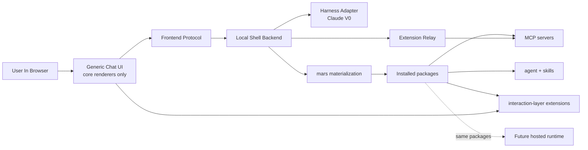

# agent-shell-mvp Design Overview

> What this is: the complete-at-this-level map of the local shell MVP after the
> correction pass.
>
> What this is not: the full contract for any one subsystem. Read a child doc
> when you need wire details, adapter mechanics, or package structure.

The shell is the **top of the funnel**, not the destination product. V0 is a
**local, BYO-Claude shell** that proves one thing: a neutral runtime plus
mars-packaged capabilities can carry a real customer workflow end to end.

The moat is **mars packaging**, not the shell chrome. The shell stays neutral.
Verticals arrive as installable packages that combine agents, skills, MCP
servers, and interaction-layer extensions. The hosted product is Act III of the
same story: **same packages, different runtime**.

## 1. V0 In One Page

- **Posture:** local-only, zero hosting, developer-mediated setup for the first
  concierge customers.
- **Customer test:** Yao Lab must be able to run the μCT workflow through a
  package that exercises every V0 extension point the shell claims to support.
- **Shell scope:** chat UI, published wire contracts, harness adapters, mars
  materialization, packaged MCP launch, and extension relay.
- **Shell non-scope:** biomedical code, PyVista, DICOM-specific views,
  project-owned virtualenvs, marketplace UI, hosted continuity features.
- **V0 discipline:** if removing a feature does not block Yao Lab, cut it; if
  keeping a shortcut traps us in six months, redesign it.

## 2. System Shape

The shell has seven subsystems:

1. **Strategy** explains the funnel, moat, concierge package-authoring posture,
   and the governing D28 test.
2. **Harness** defines the adapter boundary. Claude is the only live V0
   adapter. Codex and OpenCode remain tier-1 design targets.
3. **Events** publish the canonical normalized schema and the turn/orchestration
   flow that all adapters and clients must obey.
4. **Frontend** defines a generic chat UI and a small set of built-in content
   renderers. Anything beyond that is an extension.
5. **Extensions** define how mars-installed packages add paired frontend+MCP
   interactions beyond the built-in chat UI.
6. **Execution** defines how packaged MCP servers and local model runtimes run
   on the host.
7. **Packaging** defines how mars materializes agent-facing capability bundles
   and how the shell loads them.

## 3. V0 Boundaries

- **Architecture wide:** open `ItemKind`, published versioned seams, frontend
  designed for extraction, local and future hosted runtimes sharing the same
  package contract.
- **Implementation narrow:** Claude adapter only, one shell process, one active
  session, second tab as read-only observer, four package kinds, 3–5 built-in
  renderers, relay only for the Yao Lab class of interactions.
- **Deferred:** marketplace UI, signing enforcement, hosted continuity,
  CLI-command plugins, harness-adapter plugins, multi-session orchestration
  unification, and any shell-owned domain runtime. Per D27, deferred
  `cli_command` and `harness_adapter` kinds remain reserved open-schema
  extension points rather than closed-out features.

## 4. Subsystem Docs

- [strategy/overview.md](./strategy/overview.md)
- [strategy/funnel-and-moat.md](./strategy/funnel-and-moat.md)
- [harness/overview.md](./harness/overview.md)
- [harness/abstraction.md](./harness/abstraction.md)
- [harness/adapters.md](./harness/adapters.md)
- [harness/mid-turn-steering.md](./harness/mid-turn-steering.md)
- [events/overview.md](./events/overview.md)
- [events/normalized-schema.md](./events/normalized-schema.md)
- [events/flow.md](./events/flow.md)
- [frontend/overview.md](./frontend/overview.md)
- [frontend/chat-ui.md](./frontend/chat-ui.md)
- [frontend/content-blocks.md](./frontend/content-blocks.md)
- [frontend/protocol.md](./frontend/protocol.md)
- [extensions/overview.md](./extensions/overview.md)
- [extensions/interaction-layer.md](./extensions/interaction-layer.md)
- [extensions/relay-protocol.md](./extensions/relay-protocol.md)
- [extensions/package-contract.md](./extensions/package-contract.md)
- [execution/overview.md](./execution/overview.md)
- [execution/local-model.md](./execution/local-model.md)
- [execution/project-layout.md](./execution/project-layout.md)
- [packaging/overview.md](./packaging/overview.md)
- [packaging/agent-loading.md](./packaging/agent-loading.md)

## 5. Neutral Example

The shell itself does not ship a biomedical viewer. A package installer mounts a
custom 3D mesh viewer by installing:

- an agent profile and skill set that know when to ask for mesh inspection,
- an MCP server that produces mesh payloads and handles follow-up events, and
- a frontend extension that renders the mesh and relays user interaction back
  through the shell.

That same package should work unchanged when the runtime later moves from
local-only shell to hosted platform.

## 6. Intentionally Open

- **Q7 remains open:** should `meridian spawn` eventually consume the same
  session-lived `HarnessAdapter` family? The recommendation is yes, but this
  pass leaves it unresolved because it is broader than the shell MVP itself.
- **Mars manifest schema is not restated here:** the canonical source stays in
  [`../../mars-mcp-packaging/requirements.md`](../../mars-mcp-packaging/requirements.md).
- **Frontend extraction is designed for, not performed:** the protocol is the
  seam; the repo split is deferred.
