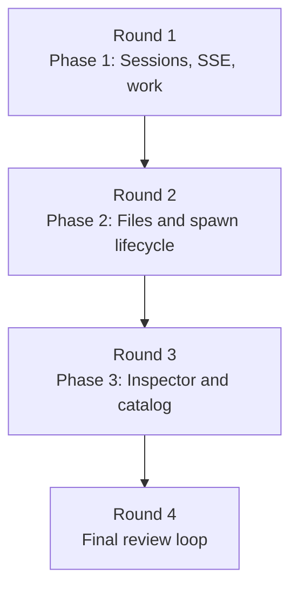

# Implementation Plan: Meridian App Backend Gaps

## Summary

Implement the missing app backend in three ordered phases that match the frontend rollout priority:

1. Sessions-mode blockers first: spawn query/stats, multiplexed SSE, and work-item HTTP facade.
2. Files mode and remaining spawn lifecycle surfaces second.
3. Inspector and catalog endpoints third.

Planning status: `plan-ready` with one explicit external dependency. `/api/work/{work_id}/sync` needs a real sync backend contract from context-backend/hook infrastructure; this plan isolates that dependency behind an app-side adapter so the rest of the app work can proceed without inventing duplicate git-sync logic.

## Parallelism Posture

**Posture:** mostly sequential

**Cause:** the phases share the FastAPI composition layer, route registration, response models, and app integration tests. Sessions-mode surfaces are also the highest-priority UI blocker. Safe parallelism exists inside phase exit gates, not across implementation phases, until the app route/service seams are extracted in Phase 1.

## Contract Baseline

Because this work item has no formal `design/spec/` tree, this plan uses backend contract IDs derived from `backend-gaps.md`:

- `APP-SESS-*` — Sessions-mode spawn list/stats/live-feed surfaces
- `APP-WORK-*` — work item CRUD, active selection, and sync
- `APP-SPAWN-*` — additional spawn lifecycle mutations
- `APP-FILES-*` — Files mode endpoints
- `APP-CAT-*` — agent/model catalog endpoints
- `APP-THREAD-*` — thread inspector endpoints

These IDs are the leaf-ownership truth for this plan.

## Round Plan

### Round 1

- Phase 1: `phase-1-sessions-sse-work`

**Justification:** Sessions mode cannot ship without filtered spawn listing, stats, live updates, and work-item state. This phase also performs the minimal app route/service extraction needed to keep later phases from bloating `server.py`.

### Round 2

- Phase 2: `phase-2-files-and-spawn-lifecycle`

**Justification:** Files mode needs a dedicated project-root security boundary and introduces the largest new read surface. The remaining spawn lifecycle actions (`fork`, `archive`) fit naturally with the same server/API expansion pass once the shared app seams from Phase 1 exist.

### Round 3

- Phase 3: `phase-3-inspector-and-catalog`

**Justification:** Catalog and inspector endpoints reuse persisted artifacts and discovery code, but they are not on the critical path for Sessions mode or Files mode. Deferring them keeps Phase 1 and Phase 2 focused on the highest-impact user flows.

### Round 4

- Final review loop

**Justification:** the final review needs the complete backend surface plus evidence from SSE, file-security, and artifact-inspection verification before converging on API shape, structural quality, and Windows/path semantics.

## Dependency and Risk Table

| Item | Planned owner | Handling |
|---|---|---|
| Single-subscriber `SpawnManager.subscribe()` blocks multiplexed live views | Phase 1 | widen subscription model to multi-subscriber broadcast without replacing existing spawn ownership |
| No work-sync runner exists in current app/work code | Phase 1 | define app-side sync adapter + durable op shape; integrate concrete backend only through that seam |
| File endpoints need project-root-relative validation and symlink-escape refusal | Phase 2 | create dedicated path-security helper and cover it with focused tests before file reads/diffs/search ship |
| Inspector links need stable IDs across restarts | Phase 3 | derive event/tool-call IDs from persisted artifact order rather than in-memory counters |
| Existing app tests cover only create-spawn + WS | All phases | expand integration suite per phase instead of relying on one end-to-end catch-all at the end |

## Refactor Handling

| Refactor ID | Disposition | Reason |
|---|---|---|
| none in local design package | local structural prep only | no `design/refactors.md` exists for this work item; required structure work is limited to extracting reusable app route/service modules in Phase 1 |

## Staffing Contract

### Per-Phase Teams

| Phase | Primary implementer | Tester lanes | Intermediate escalation policy |
|---|---|---|---|
| Phase 1 | `@coder` on profile default model | `@verifier`, `@integration-tester`, `@smoke-tester` | escalate to a scoped `@reviewer` if work-sync contract interpretation or SpawnManager broadcast changes widen beyond app/server boundaries |
| Phase 2 | `@coder` on profile default model | `@verifier`, `@unit-tester`, `@integration-tester`, `@smoke-tester` | escalate to a scoped `@reviewer` if path-security rules force cross-platform behavior changes outside the file API surface |
| Phase 3 | `@coder` on profile default model | `@verifier`, `@integration-tester`, `@smoke-tester` | escalate to a scoped `@reviewer` if artifact-derived ID semantics or harness extraction rules need design interpretation |

### Final Review Loop

- Run one default-model `@reviewer` lane for design alignment against `backend-gaps.md`, `server-lifecycle.md`, and Files-mode security constraints.
- Run one alternate-model-family `@reviewer` lane for API correctness, pagination discipline, and cross-platform path risk.
- Run one default-model `@refactor-reviewer` lane to verify the app route/service extraction stayed coherent and `server.py` did not become the new monolith.
- Re-run the affected coder plus tester lanes until reviewer findings converge to none.

### Escalation Policy

- If a tester finding is a direct implementation bug within the active phase's owned files, route it back to the phase coder with the failing evidence.
- If a tester finding depends on unresolved contract interpretation, spawn a scoped `@reviewer` instead of letting the coder guess.
- If Phase 1 cannot secure a concrete sync backend for `APP-WORK-03`, keep the adapter seam work but do not mark the phase complete; the blocked contract must remain visible in `plan/status.md`.

## Mermaid Fanout

