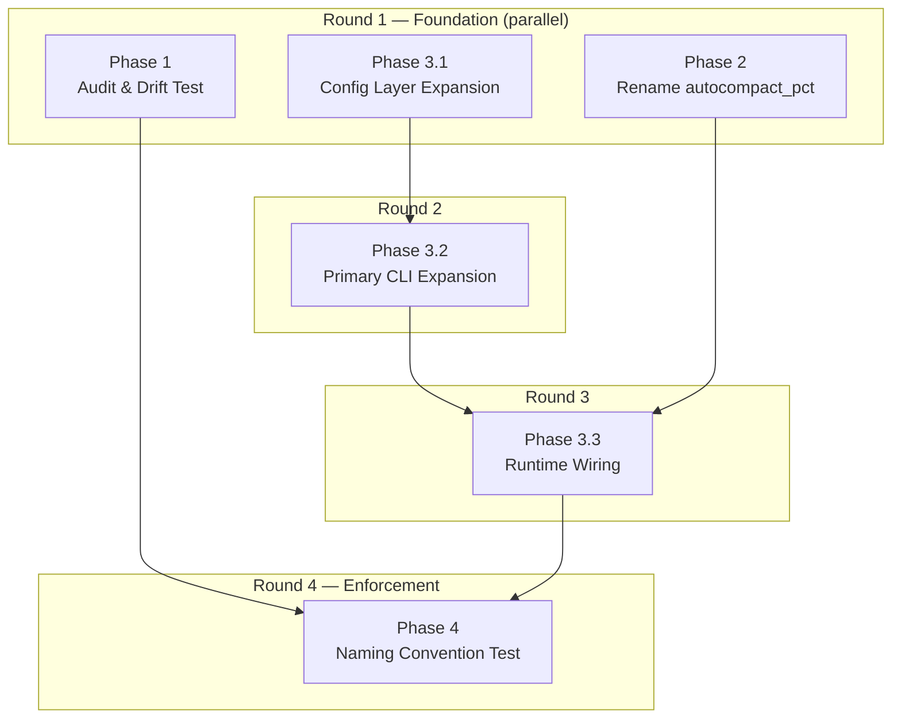

# Config Layer Unification — Implementation Plan

## Phases & Execution Rounds



## Phase Summary

| Phase | Description | Files | Depends On | Round |
|-------|-------------|-------|-----------|-------|
| 1 | Machine-readable field inventory + drift test | `tests/test_config_layer_consistency.py` | — | 1 |
| 2 | Rename `autocompact_pct` → `autocompact` with deprecated alias | `settings.py`, `prepare.py`, `plan.py` | — | 1 |
| 3.1 | Add sandbox/thinking/approval/timeout to ENV + Config | `settings.py` | — | 1 |
| 3.2 | Add --sandbox/--thinking/--approval/--timeout/--budget/--max-turns/--skills to primary CLI | `main.py`, `launch/types.py` | 3.1 | 2 |
| 3.3 | Wire config defaults + CLI through launch + spawn resolution | `launch/plan.py`, `prepare.py`, `launch/resolve.py` | 3.2, 2 | 3 |
| 4 | Naming convention enforcement test | `tests/test_config_layer_consistency.py` | All | 4 |

## Precedence Chain (target state)

```
ENV > CLI > YAML profile > Project Config > User Config > harness default
```

Each field should resolve through this chain. After all phases complete:
- **sandbox**: `MERIDIAN_SANDBOX` > `--sandbox` > profile.sandbox > `primary.sandbox` (config) > harness default
- **thinking**: `MERIDIAN_THINKING` > `--thinking` > profile.thinking > `primary.thinking` (config) > None
- **approval**: `MERIDIAN_APPROVAL` > `--approval`/`--yolo` > profile.approval > `primary.approval` (config) > "default"
- **timeout**: `MERIDIAN_TIMEOUT` > `--timeout` > `primary.timeout` (config) > None
- **autocompact**: ENV (via `primary.autocompact`) > `--autocompact` > profile.autocompact > `primary.autocompact` (config) > None

## Verification (all phases)

```bash
uv run ruff check .
uv run pyright
uv run pytest-llm
```
