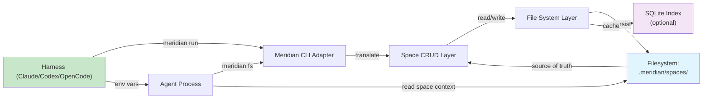

# Meridian-Channel Architecture

**Status:** Approved

## Current State

Meridian today is a functional agent coordination system with these characteristics:

- **Space metadata**: SQLite `spaces` table (not file-backed)
- **Agent profiles**: File-based (`.meridian/agents/*.md`), working correctly ✅
- **Skills**: File-based (`.meridian/skills/*.md`), with optional SQLite index
- **Sessions**: File-based (`.meridian/sessions/<session-id>/`), working correctly ✅
- **Runs**: Tracked in SQLite, outputs persisted to `.meridian/runs/`
- **Filesystem commands**: `meridian space read/write` (agent working files)
- **Active spaces**: Tracked in `.meridian/active-spaces/` (session locks)
- **Harness adapters**: Claude, Codex, OpenCode all implemented

The system works. Gaps exist but are addressable with incremental refactors.

## Target State

The target architecture prioritizes **files as source of truth** and **harness agnosticism**:

- **Space metadata**: `.meridian/<space-id>/space.md` (source of truth), SQLite as optional index
- **Agent profiles**: `.meridian/<space-id>/agents/*.md` (space-scoped), file-based ✅
- **Skills**: `.meridian/<space-id>/skills/*.md` (space-scoped), file-based ✅
- **Sessions**: `.meridian/sessions/<session-id>/` (temporary, ephemeral) ✅
- **Filesystem**: `.meridian/<space-id>/fs/` (agent working directory, git-committed)
- **CLI commands**: Unified `meridian fs` group (ls/cat/read/write/cp/mv/rm/mkdir)
- **Index**: JSON files (simpler than SQLite for coordination layer)
- **Harness integration**: Consistent env vars and error messages across harnesses

## Storage Model

### Files as Source of Truth

All persistent, authoritative space data lives in markdown/JSON files:

```
.meridian/<space-id>/
├── space.md                 # Space metadata (name, created_at, state, pinned files)
├── agents/
│   ├── primary.md          # Primary agent profile (entry point)
│   ├── researcher.md       # Child agent profile
│   └── reviewer.md
├── skills/
│   ├── research.md         # Skill definition
│   ├── review.md
│   └── implement.md
├── fs/                      # Agent working filesystem (git-committed)
│   ├── research/
│   │   └── sources.md
│   ├── drafts/
│   │   └── v1.md
│   └── feedback/
│       └── review-comments.md
└── index.json              # Optional: fast lookup (regenerable from files)
```

### SQLite as Optional Index (Not Authority)

SQLite serves only as an **optional performance index**:

- Lists of spaces (for `meridian space list`)
- Run history (for `meridian run list`)
- Quick search/filter operations

If SQLite index is corrupted or missing, it can be **regenerated from files** without data loss.

**Key principle**: SQLite never holds data that isn't also in files.

### Session Files (Temporary)

Session state is ephemeral and not recoverable:

```
.meridian/sessions/<session-id>/
├── lock                    # Process lock (released on close)
├── session.json            # Session metadata (harness, agent, space)
└── runtime/                # Temp outputs during session
    ├── stdout.log
    └── stderr.log
```

Sessions do NOT persist after a harness closes. They are the **runtime state**, not the **persistent state**.

## Directory Structure

```
repo-root/
├── .meridian/
│   ├── config.toml                    # Global meridian config
│   ├── index/
│   │   ├── spaces.json               # Cache: all spaces (regenerable)
│   │   └── run-stats.json            # Cache: aggregated run stats
│   ├── spaces/
│   │   ├── w145/                     # Space w145 (named "auth-refactor")
│   │   │   ├── space.md
│   │   │   ├── agents/
│   │   │   │   ├── primary.md
│   │   │   │   └── implementer.md
│   │   │   ├── skills/
│   │   │   │   └── implement.md
│   │   │   └── fs/                   # Agent working files (git-committed)
│   │   │       ├── research/
│   │   │       ├── drafts/
│   │   │       └── notes/
│   │   ├── w146/                     # Another space
│   │   └── w147/
│   ├── active-spaces/
│   │   ├── w145                      # Symlink/marker: space is active
│   │   └── w146
│   ├── runs/
│   │   ├── run-2025-02-28-001/
│   │   │   ├── input.md              # Original prompt
│   │   │   ├── output.md             # Agent response
│   │   │   └── metadata.json         # Run metadata
│   │   └── run-2025-02-28-002/
│   ├── sessions/
│   │   ├── sess-claude-001/          # Temporary session dir
│   │   │   ├── session.json
│   │   │   ├── lock
│   │   │   └── runtime/
│   │   └── sess-codex-001/
│   ├── artifacts/                    # Scratch space (ephemeral)
│   ├── workspaces/                   # Legacy (being phased out)
│   └── index/
├── _docs/
├── src/
└── [other repo files]
```

### space.md Format

```markdown
# Space: auth-refactor

**ID:** w145
**Created:** 2025-02-28T10:30:00Z
**State:** active
**Primary Agent:** alice
**Pinned Files:**
- fs/research/current-implementation.md
- fs/design/jwt-strategy.md

## Context

Refactoring authentication system to use JWT instead of session cookies.
Focus on backward compatibility and gradual rollout.

## Agents

- Primary: alice (research + planning)
- Implementer: bob (code changes)
- Reviewer: carol (security audit)

## Recent Activity

- 2025-02-28T10:35:00Z: alice joined
- 2025-02-28T10:45:00Z: bob completed implementation
- 2025-02-28T11:00:00Z: carol posted review comments
```

### Agent Profile Format

```markdown
# Agent: alice

**Role:** Researcher and Planner
**Skills:** research, planning, analysis
**Model:** claude-opus-4-6
**Context:** Full access to codebase and design docs

## Instructions

You are a meticulous researcher specializing in security audits.

1. Read the current auth implementation
2. Document all assumptions
3. Identify edge cases
4. Suggest improvements

Always reference sources and cite decisions.
```

### Skill Definition Format

```markdown
# Skill: research

**Category:** Information Gathering
**Description:** Researching and documenting existing systems

## Prompt Template

You are tasked with researching {{topic}}.

Please:
1. Analyze the current implementation
2. Document key assumptions
3. List potential improvements
4. Provide citations for all claims

Focus on practical, actionable findings.
```

## Data Flow Diagram



**Data flow breakdown:**

1. **Harness initiates action** → Sets `MERIDIAN_SPACE_ID` env var
2. **CLI Adapter translates** → Detects harness, adapts commands to unified format
3. **Space CRUD operates** → Reads/writes space metadata
4. **File system layer** → Persists to `.meridian/<space-id>/`
5. **SQLite index updates** → Optional, non-authoritative caching
6. **Agent spawns** → Gets space context via `.meridian/spaces/<id>/space.md`

## Harness Integration Points

Each harness provides three integration points:

### 1. Environment Variables

All harnesses set these at agent startup:

```bash
MERIDIAN_SPACE_ID=w145
MERIDIAN_AGENT_NAME=alice
MERIDIAN_PRIMARY_AGENT=true  # or false for child agents
MERIDIAN_SPACE_ROOT=/repo/.meridian/spaces/w145
```

### 2. Command Translation

Each harness has an adapter:

```python
# meridian/lib/harness/adapter.py
class HarnessAdapter:
    def detect_harness(self) -> str  # 'claude', 'codex', 'opencode'
    def execute_command(self, cmd: str) -> str  # Harness-specific execution
    def parse_output(self, output: str) -> dict  # Uniform output format
```

### 3. Session Hooks

Harnesses report lifecycle events:

```json
{
  "event": "agent_spawn",
  "harness": "claude",
  "session_id": "sess-claude-001",
  "space_id": "w145",
  "agent_name": "bob",
  "timestamp": "2025-02-28T10:35:00Z"
}
```

## Component Architecture

### CLI Layer (`src/meridian/cli/`)

- `main.py`: Entry point, global options, command registration
- `space.py`: Space start/resume/list/close/show commands
- `run.py`: Run creation and management
- `output.py`: Unified output formatting (text/JSON/porcelain)

### Operations Layer (`src/meridian/lib/ops/`)

- `space.py`: Space operations (pure, testable, format-agnostic)
- `run.py`: Run execution and tracking
- `registry.py`: Operation metadata and dispatch

### Domain Layer (`src/meridian/lib/space/`)

- `crud.py`: Space CRUD with lifecycle guards
- `launch.py`: Harness launching logic
- `session_files.py`: Session file management
- `summary.py`: Space summary generation

### Harness Layer (`src/meridian/lib/harness/`)

- `adapter.py`: Unified interface for all harnesses
- `claude.py`: Claude CLI integration
- `codex.py`: Codex CLI integration
- `opencode.py`: OpenCode integration
- `registry.py`: Harness detection and selection

### Storage Layer (`src/meridian/lib/adapters/`)

- `sqlite.py`: SQLite state management (optional index)
- `filesystem.py`: File I/O for spaces, agents, skills

## Key Design Decisions

### 1. Files as Authority

**Decision**: Markdown files are the source of truth, SQLite is optional.

**Rationale**:
- Files are diffable, mergeable, version-controllable
- No schema migrations needed
- Easy to understand without database tools
- Robust to partial failures (corrupted SQLite doesn't lose data)

### 2. Space-Scoped Metadata

**Decision**: Agent profiles and skills live under spaces, not globally.

**Rationale**:
- Agents and skills can be customized per space
- Spaces are self-contained and portable
- No global registry collisions
- Simpler permission model (all agents in space → read all metadata)

### 3. Explicit Session Model

**Decision**: Users must set `MERIDIAN_SPACE_ID` upfront (no auto-create).

**Rationale**:
- Sessions are explicit coordination points
- No ambiguity about which space an agent is working in
- Clear error messaging when env var is missing
- Prevents accidental space creation

### 4. Harness Adapters, Not Wrappers

**Decision**: Meridian adapts to harnesses, harnesses don't need to know about Meridian.

**Rationale**:
- Harnesses (Claude, Codex, OpenCode) are not Meridian extensions
- Meridian is optional plumbing, not required
- Agents work without Meridian (just no coordination)
- Harnesses can evolve independently

### 5. No Conflict Resolution

**Decision**: Meridian doesn't resolve conflicts, humans do.

**Rationale**:
- Agents are tools, not decision makers
- Humans own final arbitration
- Git handles version control naturally
- Simpler system, clearer boundaries
