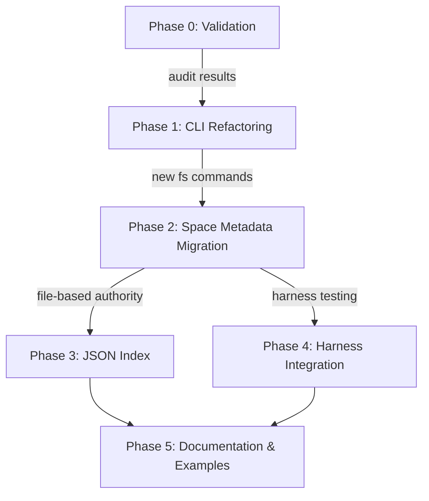

# Meridian-Channel Implementation Plan

**Status:** Approved

This document provides a sequenced, actionable plan to close gaps between current and target architecture. Each task can be independently tested and reviewed.

## Overview

The plan is organized into **5 phases**, progressively building from CLI refactoring through harness integration. Each phase builds on prior work and can be executed (or parallelized where independent).

### Phase Dependencies

---

## Phase 0: Validation (Pre-Implementation)

**Goal**: Audit current codebase and document baseline behavior.

**Status**: Not started

### Task 0.1: Audit Current Implementation

**Description:**
Review current meridian-channel codebase against ARCHITECTURE.md and BEHAVIORS.md. Document any divergences.

**Acceptance Criteria:**
- [ ] All CLI commands tested and verified
- [ ] Space CRUD layer behavior documented
- [ ] Filesystem I/O patterns identified
- [ ] Harness adapters validated
- [ ] No surprises before Phase 1 starts

**Affected Files:**
- `src/meridian/cli/main.py`
- `src/meridian/cli/space.py`
- `src/meridian/lib/space/crud.py`
- `src/meridian/lib/harness/{claude,codex,opencode}.py`

**Estimated Effort:** Small (2-4 hours)

**Risk:** Low

**Notes:**
- Check for any undocumented CLI commands
- Verify SQLite schema matches assumptions
- Test error messages match BEHAVIORS.md

---

### Task 0.2: Verify Current Space Behavior

**Description:**
Run end-to-end test of space creation, resumption, and closure. Ensure current behavior matches BEHAVIORS.md.

**Acceptance Criteria:**
- [ ] Create space with `meridian space start`
- [ ] Resume space with `meridian space resume`
- [ ] List spaces with `meridian space list`
- [ ] Close space with `meridian space close`
- [ ] All outputs match expected format in BEHAVIORS.md

**Affected Files:**
- Test scripts or manual testing

**Estimated Effort:** Small (1-2 hours)

**Risk:** Low

**Notes:**
- Document any output format differences
- Check if space IDs are human-readable or UUID-like
- Verify lock behavior during concurrent access

---

### Task 0.3: Document Divergences

**Description:**
Create a short report of any gaps between current implementation and documented behavior.

**Acceptance Criteria:**
- [ ] Divergence report written and reviewed
- [ ] No blocking issues identified for Phase 1
- [ ] Team agrees validation is complete

**Affected Files:**
- `_docs/meridian-channel/VALIDATION-REPORT.md` (new, temporary)

**Estimated Effort:** Small (1 hour)

**Risk:** None

---

## Phase 1: CLI Refactoring (High Impact, Enables Testing)

**Goal**: Create unified `meridian fs` command group with ls/cat/read/write/cp/mv/rm/mkdir.

**Dependencies**: Phase 0 complete

**Timeline**: ~1-2 weeks

### Task 1.1: Rename `meridian space read/write` to `meridian fs`

**Description:**
Refactor existing `space read/write` commands into a new `fs` command group. Maintain backward compatibility during transition.

**Acceptance Criteria:**
- [ ] `meridian fs read <path>` works (replaces `meridian space read`)
- [ ] `meridian fs write <path>` works (replaces `meridian space write`)
- [ ] Old commands still work with deprecation warning (or removed)
- [ ] Help text updated
- [ ] All tests pass

**Affected Files:**
- `src/meridian/cli/main.py` (register new command group)
- `src/meridian/cli/filesystem.py` (NEW - new command group)
- `src/meridian/cli/space.py` (update or deprecate old commands)
- `src/meridian/lib/ops/filesystem.py` (NEW - operation specs)

**Estimated Effort:** Small (4-6 hours)

**Risk:** Low (non-breaking if backward compatible)

**Complexity:** Command routing, help text generation

**Notes:**
- Keep old commands working for 1 release if possible
- Add `--deprecated` warning to old commands
- Update all documentation

---

### Task 1.2: Implement `meridian fs ls`

**Description:**
New command to list files in a space's `fs/` directory.

**Acceptance Criteria:**
- [ ] `meridian fs ls` lists root fs/ directory
- [ ] `meridian fs ls <path>` lists subdirectory
- [ ] Output shows file size and modification time
- [ ] `--recursive` flag shows full tree
- [ ] Error handling for missing paths

**Affected Files:**
- `src/meridian/cli/filesystem.py` (add `ls` subcommand)
- `src/meridian/lib/ops/filesystem.py` (add `list_files` operation)

**Estimated Effort:** Small (2-3 hours)

**Risk:** Low

**Complexity:** Directory traversal, formatting

**Notes:**
- Use consistent formatting with unix `ls`
- Consider `--json` output for tool compatibility

---

### Task 1.3: Implement `meridian fs cat`

**Description:**
Print file contents. Shorthand for `read` when you want everything.

**Acceptance Criteria:**
- [ ] `meridian fs cat <path>` prints full file
- [ ] Binary files show size/type instead of contents
- [ ] File not found error with helpful message
- [ ] Works with stdin pipe

**Affected Files:**
- `src/meridian/cli/filesystem.py` (add `cat` subcommand)
- `src/meridian/lib/ops/filesystem.py` (add `cat` operation)

**Estimated Effort:** Small (1-2 hours)

**Risk:** Low

**Complexity:** Binary detection, large file handling

---

### Task 1.4: Implement `meridian fs cp` and `meridian fs mv`

**Description:**
Copy and move files/directories within space.

**Acceptance Criteria:**
- [ ] `meridian fs cp <src> <dst>` copies file
- [ ] `meridian fs cp <dir> <dst> --recursive` copies directory
- [ ] `meridian fs mv <src> <dst>` moves/renames
- [ ] Parent directories created as needed
- [ ] Warning before overwrite (unless `--force`)
- [ ] Error if source doesn't exist

**Affected Files:**
- `src/meridian/cli/filesystem.py` (add `cp`, `mv` subcommands)
- `src/meridian/lib/ops/filesystem.py` (add operations)

**Estimated Effort:** Small (3-4 hours)

**Risk:** Low

**Complexity:** Directory recursion, path validation

**Notes:**
- Test with symlinks (reject or follow?)
- Decide on behavior for existing destinations

---

### Task 1.5: Implement `meridian fs rm` and `meridian fs mkdir`

**Description:**
Delete files and create directories.

**Acceptance Criteria:**
- [ ] `meridian fs rm <path>` deletes file
- [ ] `meridian fs rm <dir> --recursive` deletes directory
- [ ] Confirm before delete (unless `--force`)
- [ ] `meridian fs mkdir <path>` creates dirs (idempotent)
- [ ] Error if mkdir target already exists as file

**Affected Files:**
- `src/meridian/cli/filesystem.py` (add `rm`, `mkdir` subcommands)
- `src/meridian/lib/ops/filesystem.py` (add operations)

**Estimated Effort:** Small (2-3 hours)

**Risk:** Medium (rm is destructive, need good UX)

**Complexity:** Confirmation dialogs, safety checks

**Notes:**
- Make `rm` very safe (confirm, maybe trash instead of delete?)
- Document that deleted files can't be recovered
- Consider git integration (automatically commit after fs changes?)

---

### Task 1.6: Path Validation and Security

**Description:**
Add validation to prevent path traversal attacks (e.g., `../../etc/passwd`).

**Acceptance Criteria:**
- [ ] All fs commands validate paths
- [ ] `../../etc/passwd` rejected with clear error
- [ ] Absolute paths rejected (or resolved to relative)
- [ ] Symlink traversal handled safely
- [ ] Tests for edge cases

**Affected Files:**
- `src/meridian/lib/adapters/filesystem.py` (add validation)
- `src/meridian/lib/ops/filesystem.py` (use validation)

**Estimated Effort:** Small (2-3 hours)

**Risk:** High (security-critical)

**Complexity:** Path normalization, symlink handling

**Notes:**
- Use `pathlib.Path.resolve()` carefully
- Test with relative paths containing `..`
- Document validation rules clearly

---

### Task 1.7: Tests and Documentation for Phase 1

**Description:**
Write unit and integration tests for all fs commands. Update help text and docs.

**Acceptance Criteria:**
- [ ] Unit tests for path validation
- [ ] Integration tests for each command
- [ ] Help text generated and human-reviewed
- [ ] BEHAVIORS.md verified against implementation
- [ ] All tests pass

**Affected Files:**
- `tests/meridian/cli/test_filesystem.py` (NEW)
- `tests/meridian/lib/ops/test_filesystem.py` (NEW)
- `src/meridian/cli/filesystem.py` (docstrings)

**Estimated Effort:** Medium (4-6 hours)

**Risk:** Low

**Notes:**
- Include tests for error cases
- Test with unicode filenames
- Test with very large files

---

## Phase 2: Space Metadata Migration (Medium Impact, Core Refactor)

**Goal**: Move space metadata from SQLite to `.meridian/<space-id>/space.md`. Keep SQLite as optional index.

**Dependencies**: Phase 1 complete

**Timeline**: ~2-3 weeks

### Task 2.1: Design `space.md` Format

**Description:**
Finalize the format for `space.md` files. Document schema in ARCHITECTURE.md.

**Acceptance Criteria:**
- [ ] Format includes: ID, name, created_at, state, primary_agent, pinned_files
- [ ] Version field for schema evolution
- [ ] Extensible for future fields
- [ ] Example file created and reviewed
- [ ] Schema versioning strategy documented

**Affected Files:**
- `_docs/meridian-channel/ARCHITECTURE.md` (update space.md section)
- `_docs/schema/space-schema.md` (NEW - detailed schema)

**Estimated Effort:** Small (2-3 hours)

**Risk:** Low

**Complexity:** YAML/TOML frontmatter design

**Notes:**
- Use YAML frontmatter for structure, markdown for content
- Consider `git diff` readability when designing format
- Test with agent-generated files (can they round-trip?)

---

### Task 2.2: Create Migration Script (SQLite → Files)

**Description:**
Write script to export all spaces from SQLite and generate `.meridian/<space-id>/space.md` for each.

**Acceptance Criteria:**
- [ ] Script reads SQLite `spaces` table
- [ ] Generates markdown file for each space
- [ ] Files match format from Task 2.1
- [ ] No data loss (all fields preserved)
- [ ] Script is idempotent (safe to run multiple times)
- [ ] Tested on real database (dry-run and verified)

**Affected Files:**
- `scripts/migrate-spaces-to-files.py` (NEW)
- Data integrity verification script

**Estimated Effort:** Small (3-4 hours)

**Risk:** Medium (data migration, backup before running)

**Complexity:** SQLite querying, file generation

**Notes:**
- Backup SQLite before running
- Generate dry-run report first
- Keep SQLite intact (don't delete after migration)

---

### Task 2.3: Refactor Space CRUD to Read/Write Files

**Description:**
Update `lib/space/crud.py` to read/write space metadata from `.meridian/<space-id>/space.md` instead of SQLite.

**Acceptance Criteria:**
- [ ] `create_space()` writes to file (and optionally to SQLite)
- [ ] `get_space()` reads from file first, falls back to SQLite
- [ ] `update_space()` writes to file
- [ ] `delete_space()` removes file
- [ ] All operations maintain backward compatibility
- [ ] Tests pass for both file and SQLite paths

**Affected Files:**
- `src/meridian/lib/space/crud.py` (refactor)
- `src/meridian/lib/adapters/filesystem.py` (enhance file I/O)
- `src/meridian/lib/adapters/sqlite.py` (keep for backward compat)

**Estimated Effort:** Medium (6-8 hours)

**Risk:** Medium (core CRUD logic change)

**Complexity:** Dual-write for backward compatibility, error handling

**Notes:**
- Implement dual-write: write to file AND SQLite during transition
- Log which source is being read (file vs DB)
- Document fallback strategy clearly

---

### Task 2.4: Update Operations Layer

**Description:**
Update `lib/ops/space.py` to use file-based metadata as source of truth.

**Acceptance Criteria:**
- [ ] `list_spaces()` reads from files (or generates from directory scan)
- [ ] `show_space()` reads from file
- [ ] `get_space_summary()` generated from file metadata
- [ ] All operations use CRUD layer (no direct file access)
- [ ] Tests verify file-based behavior

**Affected Files:**
- `src/meridian/lib/ops/space.py` (update to use files)
- `src/meridian/lib/space/crud.py` (provides source of truth)

**Estimated Effort:** Small (2-3 hours)

**Risk:** Low (ops layer is just a client of CRUD)

**Notes:**
- Prefer CRUD layer over direct file access
- Profile performance (directory scanning might be slow)
- Consider index caching for `list_spaces()`

---

### Task 2.5: Update Index Layer (JSON Optional)

**Description:**
Create `index/spaces.json` as optional cache. Update index regeneration to source from files.

**Acceptance Criteria:**
- [ ] Index generator scans `.meridian/spaces/*/space.md`
- [ ] Generates `index/spaces.json` with format from IMPLEMENTATION-GAPS.md
- [ ] Index is regenerated on space create/update/delete
- [ ] `meridian space list` uses index (or generates on-the-fly)
- [ ] Index can be safely deleted and regenerated

**Affected Files:**
- `src/meridian/lib/adapters/index.py` (NEW)
- `src/meridian/lib/space/summary.py` (update to use files)
- `src/meridian/lib/ops/space.py` (use new index)

**Estimated Effort:** Small (2-3 hours)

**Risk:** Low (non-authoritative cache)

**Complexity:** JSON generation, cache invalidation

**Notes:**
- Don't require index to exist (generate on-the-fly if missing)
- Profile performance vs accuracy
- Consider git ignoring index (not committing)

---

### Task 2.6: Tests for Phase 2

**Description:**
Write comprehensive tests for space CRUD and migration.

**Acceptance Criteria:**
- [ ] Unit tests for CRUD operations
- [ ] Integration tests for space lifecycle
- [ ] Migration test (SQLite → files)
- [ ] Backward compatibility tests (fallback to SQLite)
- [ ] All tests pass

**Affected Files:**
- `tests/meridian/lib/space/test_crud.py` (new/updated)
- `tests/meridian/lib/ops/test_space.py` (updated)
- `tests/migration/test_spaces_migration.py` (NEW)

**Estimated Effort:** Medium (4-6 hours)

**Risk:** Low

**Notes:**
- Test with empty spaces
- Test with special characters in names
- Test concurrent access

---

## Phase 3: JSON Index (Optional, Low Impact)

**Goal**: Replace SQLite index with JSON files. Simpler, more transparent, no schema migrations.

**Dependencies**: Phase 2 complete (files are source of truth)

**Timeline**: ~1-2 weeks

**Status**: Optional. Can be deferred or skipped if Phase 2 performance is acceptable.

### Task 3.1: Design JSON Index Format

**Description:**
Finalize JSON index structure for spaces list, run stats, etc.

**Acceptance Criteria:**
- [ ] Format includes all necessary fields for `meridian space list`
- [ ] Example files created
- [ ] Schema documented
- [ ] Extensible for future metrics

**Affected Files:**
- `_docs/schema/index-schema.md` (NEW)

**Estimated Effort:** Small (1-2 hours)

**Risk:** None

---

### Task 3.2: Implement JSON Index Generator

**Description:**
Create index generation logic that scans files and generates JSON.

**Acceptance Criteria:**
- [ ] Generator reads `.meridian/spaces/*/space.md`
- [ ] Generates `index/spaces.json`
- [ ] Runs on space create/update/delete
- [ ] Handles missing/corrupted space files gracefully
- [ ] Performance acceptable for 100+ spaces

**Affected Files:**
- `src/meridian/lib/adapters/index.py` (enhance)
- `src/meridian/lib/space/summary.py` (index generation)

**Estimated Effort:** Small (2-3 hours)

**Risk:** Low

---

### Task 3.3: Update `meridian space list` to Use JSON

**Description:**
Refactor `meridian space list` to read from JSON index instead of SQLite.

**Acceptance Criteria:**
- [ ] `meridian space list` reads from `index/spaces.json`
- [ ] Falls back to generating index if missing
- [ ] Output matches BEHAVIORS.md specification
- [ ] Performance is acceptable (< 100ms)

**Affected Files:**
- `src/meridian/lib/ops/space.py` (update list operation)

**Estimated Effort:** Small (1-2 hours)

**Risk:** Low

---

### Task 3.4: Keep SQLite Optional (Deprecation Path)

**Description:**
Document SQLite as deprecated but still supported. Provide migration path for users.

**Acceptance Criteria:**
- [ ] SQLite reads still work (for backward compat)
- [ ] Deprecation notice in docs
- [ ] Clear migration path documented
- [ ] Timeline for SQLite removal (if desired)

**Affected Files:**
- `_docs/meridian-channel/MIGRATION-GUIDE.md` (NEW)
- `src/meridian/lib/adapters/sqlite.py` (add deprecation comments)

**Estimated Effort:** Small (1-2 hours)

**Risk:** None

---

### Task 3.5: Tests for Phase 3

**Description:**
Verify index generation and reading works correctly.

**Acceptance Criteria:**
- [ ] Unit tests for index generation
- [ ] Integration tests for `meridian space list`
- [ ] Performance tests (100+ spaces)
- [ ] All tests pass

**Affected Files:**
- `tests/meridian/lib/adapters/test_index.py` (NEW)

**Estimated Effort:** Small (2-3 hours)

**Risk:** Low

---

## Phase 4: Harness Integration Testing (Medium Impact)

**Goal**: Verify that harness adapters work correctly across Claude, Codex, OpenCode.

**Dependencies**: Phase 1 complete (new fs commands enable fuller testing)

**Timeline**: ~2-3 weeks (parallel with Phase 3)

**Status**: Optional. Can run in parallel with Phase 3.

### Task 4.1: End-to-End Test with Claude

**Description:**
Create comprehensive test workflow using Claude harness.

**Acceptance Criteria:**
- [ ] Space creation with `meridian space start`
- [ ] Agent spawning with `meridian run`
- [ ] Filesystem operations (fs read/write/ls/cp)
- [ ] Space resumption with `meridian space resume`
- [ ] Space closure with `meridian space close`
- [ ] All workflows produce expected outputs

**Affected Files:**
- `tests/e2e/test_claude_integration.sh` (NEW)

**Estimated Effort:** Medium (4-6 hours)

**Risk:** Medium (depends on harness availability)

**Notes:**
- Automate using `./scripts/get-token.sh`
- Test with actual Claude CLI
- Document any harness-specific quirks

---

### Task 4.2: End-to-End Test with Codex

**Description:**
Same workflow as Task 4.1 but with Codex harness.

**Acceptance Criteria:**
- [ ] Space creation/resumption/closure
- [ ] Agent spawning and execution
- [ ] Filesystem operations
- [ ] Verify output format consistency

**Affected Files:**
- `tests/e2e/test_codex_integration.sh` (NEW)

**Estimated Effort:** Medium (4-6 hours)

**Risk:** Medium

**Notes:**
- Compare output with Claude test
- Document any differences
- Test edge cases unique to Codex

---

### Task 4.3: End-to-End Test with OpenCode

**Description:**
Same workflow as Tasks 4.1 and 4.2 but with OpenCode harness.

**Acceptance Criteria:**
- [ ] All workflows work as expected
- [ ] Output consistent across harnesses
- [ ] Error messages translated correctly

**Affected Files:**
- `tests/e2e/test_opencode_integration.sh` (NEW)

**Estimated Effort:** Medium (4-6 hours)

**Risk:** Medium

---

### Task 4.4: Multi-Harness Collaboration Test

**Description:**
Test agents spawning agents across different harnesses.

**Acceptance Criteria:**
- [ ] Claude spawns Codex child agent
- [ ] Codex spawns OpenCode child agent
- [ ] Agents read/write to shared fs/
- [ ] Session context preserved across harnesses
- [ ] Outputs correct and complete

**Affected Files:**
- `tests/e2e/test_multi_harness.sh` (NEW)

**Estimated Effort:** Medium (4-6 hours)

**Risk:** High (complex interaction)

**Notes:**
- Document which harnesses can spawn which
- Test sequential and parallel spawning
- Verify `MERIDIAN_SPACE_ID` env var preserved

---

### Task 4.5: Error Handling and Recovery Tests

**Description:**
Test error cases and recovery paths.

**Acceptance Criteria:**
- [ ] Missing `MERIDIAN_SPACE_ID` → clear error
- [ ] Space not found → helpful error with suggestions
- [ ] Harness timeout → graceful timeout with message
- [ ] Filesystem path traversal → rejected
- [ ] All error messages match BEHAVIORS.md

**Affected Files:**
- `tests/e2e/test_error_cases.sh` (NEW)

**Estimated Effort:** Small (2-3 hours)

**Risk:** Low

---

### Task 4.6: Document Harness Integration Issues

**Description:**
Document any integration issues found, and solutions/workarounds.

**Acceptance Criteria:**
- [ ] Issues documented in `_docs/technical/harness-integration-notes.md`
- [ ] Workarounds provided
- [ ] Timeline for fixes identified

**Affected Files:**
- `_docs/technical/harness-integration-notes.md` (NEW)

**Estimated Effort:** Small (2-3 hours)

**Risk:** None

---

## Phase 5: Documentation & Examples (Low Impact, High Value)

**Goal**: Complete documentation of all features and workflows. Create usable examples.

**Dependencies**: Phases 1-4 mostly complete

**Timeline**: ~2-3 weeks

### Task 5.1: Update BEHAVIORS.md with CLI Examples

**Description:**
Add complete, copy-paste-able examples for all commands.

**Acceptance Criteria:**
- [ ] All commands in BEHAVIORS.md have examples
- [ ] Examples are tested and verified
- [ ] Error cases shown
- [ ] Example outputs are realistic

**Affected Files:**
- `_docs/meridian-channel/BEHAVIORS.md` (enhance)

**Estimated Effort:** Small (2-3 hours)

**Risk:** Low

---

### Task 5.2: Create Workflow Tutorials

**Description:**
Write 5-10 realistic workflows showing how to use Meridian.

**Acceptance Criteria:**
- [ ] Writer workflow (story development)
- [ ] Engineer workflow (code refactoring)
- [ ] Research workflow (multi-agent coordination)
- [ ] Each has clear steps and expected outputs
- [ ] All tested and verified

**Affected Files:**
- `_docs/meridian-channel/WORKFLOWS.md` (NEW)

**Estimated Effort:** Medium (4-6 hours)

**Risk:** Low

---

### Task 5.3: Video Walkthroughs (Optional)

**Description:**
Create short video (~5-10 min) showing Meridian in action.

**Acceptance Criteria:**
- [ ] Covers space creation, agent spawning, fs operations
- [ ] Shows multi-agent workflow
- [ ] Clear narration
- [ ] Posted to [location TBD]

**Affected Files:**
- Video files (not tracked in git)

**Estimated Effort:** Large (if doing video)

**Risk:** Low

**Notes:**
- Consider automating with `asciinema` or similar
- Optional, can be deferred

---

### Task 5.4: Update meridian-channel README.md

**Description:**
Refresh README with current state, features, quick-start guide.

**Acceptance Criteria:**
- [ ] README reflects all features from BEHAVIORS.md
- [ ] Quick-start section works end-to-end
- [ ] Links to VISION, ARCHITECTURE, BEHAVIORS docs
- [ ] Links to workflow examples

**Affected Files:**
- `_docs/meridian-channel/README.md` (NEW/update)

**Estimated Effort:** Small (2-3 hours)

**Risk:** Low

---

### Task 5.5: API Reference

**Description:**
Detailed API reference for all CLI commands.

**Acceptance Criteria:**
- [ ] All commands documented
- [ ] Flags and options explained
- [ ] Examples for each
- [ ] Error codes documented

**Affected Files:**
- `_docs/meridian-channel/API-REFERENCE.md` (NEW)

**Estimated Effort:** Medium (3-4 hours)

**Risk:** Low

**Notes:**
- Auto-generate from `--help` if possible
- Document environment variables
- Include exit codes

---

### Task 5.6: Contribution Guide

**Description:**
Guide for contributors on architecture and patterns.

**Acceptance Criteria:**
- [ ] Design patterns explained (CRUD, adapters, etc.)
- [ ] File organization documented
- [ ] Testing strategy explained
- [ ] PR process defined

**Affected Files:**
- `_docs/meridian-channel/CONTRIBUTING.md` (NEW)

**Estimated Effort:** Small (2-3 hours)

**Risk:** None

---

### Task 5.7: Migration and Upgrade Guide

**Description:**
Document how to migrate from old Meridian to new (if applicable).

**Acceptance Criteria:**
- [ ] Migration steps clear
- [ ] Backward compatibility explained
- [ ] Testing recommendations
- [ ] Rollback plan

**Affected Files:**
- `_docs/meridian-channel/MIGRATION-GUIDE.md` (NEW)

**Estimated Effort:** Small (1-2 hours)

**Risk:** Low

---

## Summary Timeline

| Phase | Tasks | Effort | Timeline | Parallel? |
|-------|-------|--------|----------|-----------|
| 0: Validation | 3 | Small | 1 week | - |
| 1: CLI Refactoring | 7 | Medium | 2 weeks | After Phase 0 |
| 2: Space Metadata | 6 | Medium | 3 weeks | After Phase 1 |
| 3: JSON Index | 5 | Small | 1-2 weeks | Parallel with Phase 4 |
| 4: Harness Testing | 6 | Medium | 2-3 weeks | Parallel with Phase 3 |
| 5: Documentation | 7 | Medium | 2-3 weeks | After Phases 1-4 |

**Total:** ~12-15 weeks, with parallelization reducing to ~8-10 weeks.

---

## Decision Gates

Before each phase:

1. **Phase 0 → 1**: Validation report approved, no blockers identified
2. **Phase 1 → 2**: All CLI commands working, tests passing
3. **Phase 2 → 3**: Space metadata migrated, backward compat verified
4. **Phase 3 → 4**: JSON index in place (optional, can skip)
5. **Phase 4 → 5**: All harness tests passing
6. **Phase 5 → Release**: Documentation reviewed, examples tested

---

## Rollback and Recovery

**If Phase 2 fails (space migration):**
- Keep SQLite intact (don't delete)
- Revert file writes
- Fall back to SQLite reads
- Investigate root cause
- Retry migration with fixes

**If Phase 1 breaks existing commands:**
- Keep old commands working during transition
- Use deprecation warnings, not errors
- Maintain test coverage for both old and new

**If tests fail in Phase 4:**
- Investigate harness-specific issues
- Document workarounds
- Schedule follow-up tasks
- Prioritize by harness usage

---

## Success Criteria

All phases complete when:

- [ ] All CLI commands implemented and tested
- [ ] Space metadata in files (SQLite optional)
- [ ] Filesystem operations working across all harnesses
- [ ] Multi-harness workflows tested end-to-end
- [ ] Documentation complete and up-to-date
- [ ] All tests passing
- [ ] User workflows from BEHAVIORS.md verified
