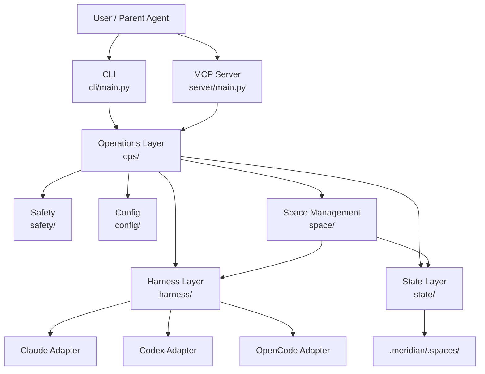
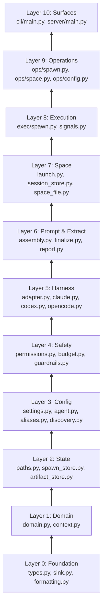
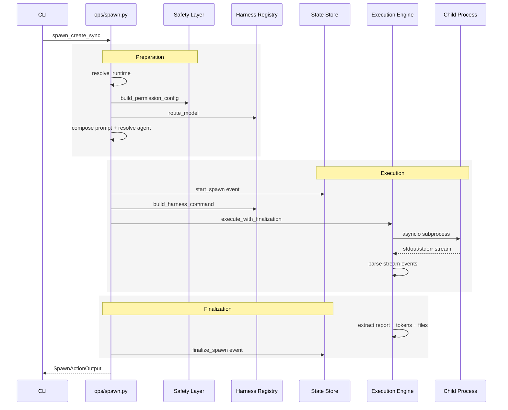
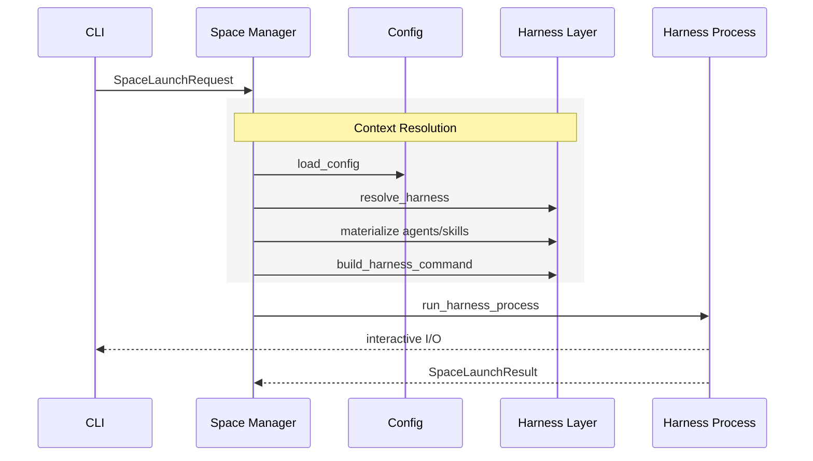
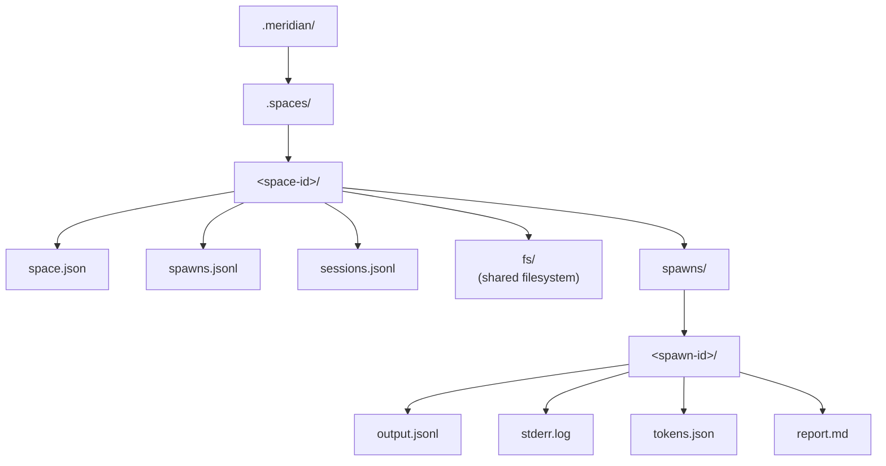
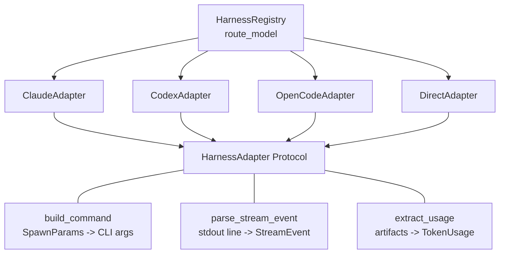
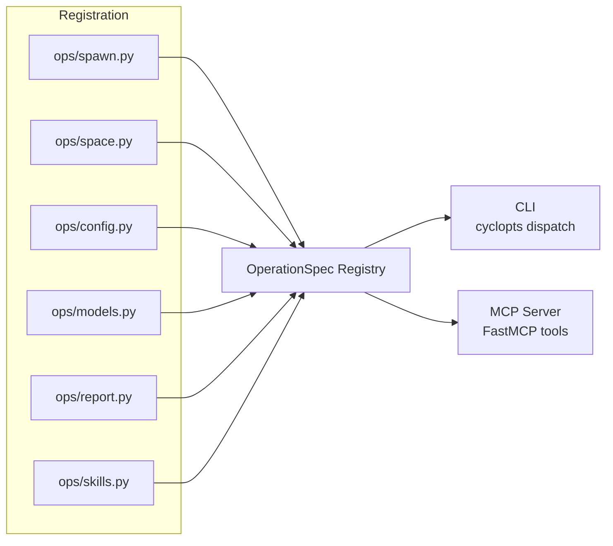
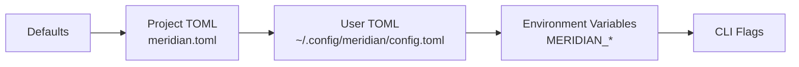
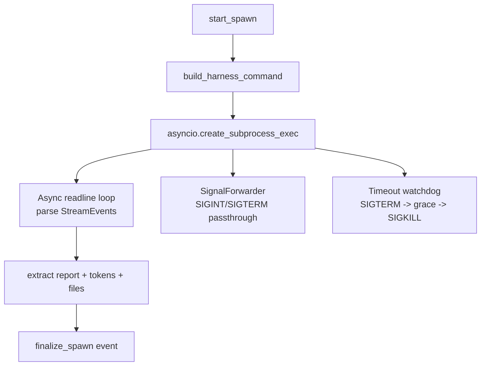
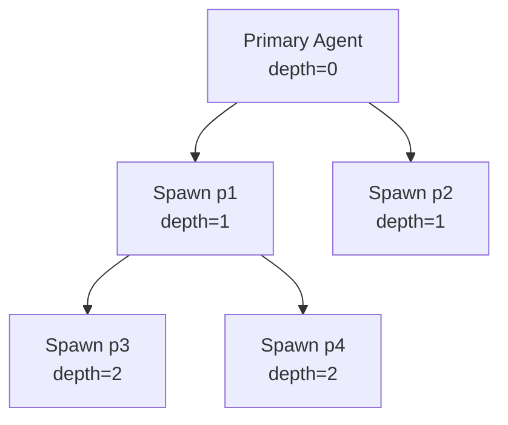

# Architecture

Meridian is a coordination layer for multi-agent systems. It is not a filesystem, execution engine, or data warehouse. It provides scaffolding for launching, tracking, and inspecting AI agent spawns across multiple harnesses.

## System Overview



## Layer Dependency Order

The codebase follows strict layered architecture. Each layer may only import from layers below it.



---

## Core Concepts

### Space

A self-contained agent ecosystem. Each space has a primary agent and zero or more child spawns, all sharing a filesystem under `.meridian/.spaces/<space-id>/fs/`. Two states: `active` and `closed`.

### Spawn

A single agent execution within a space. Spawns are launched via `meridian spawn`, tracked via JSONL events, and can be nested (a spawn can create child spawns).

### Harness

An AI backend adapter. The same `meridian spawn` command works across Claude, Codex, and OpenCode. Each harness translates spawn parameters into the native CLI invocation for that backend.

### Agent Profile

A YAML-frontmatter markdown file defining an agent's capabilities: model, skills, sandbox permissions, and system prompt body.

### Skill

Domain knowledge loaded into an agent at launch time. Skills survive context compaction because they are injected fresh on every launch/resume.

---

## Directory Layout

```
src/meridian/
  cli/                    # Command-line interface (cyclopts)
    main.py               # Entry point, global options, command dispatch
    spawn.py              # Spawn subcommand handlers
    output.py             # Output sink (text/json/agent mode)
  server/                 # MCP server (FastMCP on stdio)
    main.py               # Auto-registers all ops as MCP tools
  lib/
    types.py              # NewType identifiers (SpaceId, SpawnId, ModelId, ...)
    domain.py             # Frozen Pydantic domain models
    context.py            # RuntimeContext from environment variables
    sink.py               # Output sink protocol
    formatting.py         # Display formatting
    serialization.py      # JSON serialization helpers
    config/               # Configuration loading
      settings.py         # pydantic-settings BaseSettings (TOML + env)
      agent.py            # Agent profile parsing (YAML frontmatter)
      skill.py            # Skill spec loading
      aliases.py          # Model alias resolution
      discovery.py        # Agent/skill filesystem discovery
      routing.py          # Model-to-harness routing rules
    safety/               # Permission and budget enforcement
      permissions.py      # PermissionTier enum, flag resolution
      budget.py           # Token budget tracking
      guardrails.py       # Content guardrails
      redaction.py        # Secret redaction
    harness/              # AI backend adapters
      adapter.py          # HarnessAdapter protocol, SpawnParams, SpawnResult
      registry.py         # HarnessRegistry (model routing)
      claude.py           # Claude Code adapter
      codex.py            # Codex CLI adapter
      opencode.py         # OpenCode adapter
      direct.py           # Direct (in-process) adapter
      layout.py           # Harness directory layout
      materialize.py      # Copy agents/skills into harness dirs
      launch_types.py     # Launch parameter types
      session_detection.py# External session log parsing
    space/                # Space lifecycle management
      launch.py           # Primary agent launch orchestration
      space_file.py       # space.json CRUD
      session_store.py    # Session tracking (JSONL)
      crud.py             # Space create/list/close
    state/                # File-backed state persistence
      paths.py            # SpacePaths, StatePaths resolution
      spawn_store.py      # Spawn event store (JSONL)
      artifact_store.py   # Artifact storage
      id_gen.py           # Sequential ID generation
    exec/                 # Subprocess execution
      spawn.py            # Async subprocess orchestration
      signals.py          # Signal forwarding (SIGINT/SIGTERM)
      process_groups.py   # Process group management
    ops/                  # Business logic operations
      registry.py         # OperationSpec + global registry
      spawn.py            # spawn.create, spawn.list, spawn.show, spawn.wait
      space.py            # space.start, space.resume, space.list
      config.py           # config.get, config.set, config.init
      report.py           # report.show, report.create
      models.py           # models.list, models.show
      skills.py           # skills.list
      diag.py             # doctor diagnostics
      codec.py            # Input coercion and schema generation
    prompt/               # Prompt composition
      assembly.py         # Assemble prompt from parts
      reference.py        # Reference file handling
    extract/              # Post-spawn extraction
      finalize.py         # Extract report, tokens, files from output
      report.py           # Report extraction logic
      files_touched.py    # Detect modified files
```

---

## Data Flow: `meridian spawn`



## Data Flow: `meridian start`



---

## State Model

All state lives in files. No database. JSONL append-only events for spawns and sessions, JSON for space metadata. Atomic writes via `tmp` + `os.replace()`, concurrency via `fcntl.flock`.



### Event Sourcing

Spawn lifecycle is tracked as append-only JSONL events in `spawns.jsonl`:

```json
{"event": "start", "spawn_id": "p1", "model": "claude-sonnet-4-6", "prompt": "...", "ts": "..."}
{"event": "finalize", "spawn_id": "p1", "status": "succeeded", "duration_secs": 42.5, "ts": "..."}
```

Session lifecycle follows the same pattern in `sessions.jsonl`. Both use Pydantic event models (`SpawnStartEvent`, `SessionStartEvent`, etc.) for typed serialization at I/O boundaries.

---

## Harness System

The harness layer abstracts AI backend differences behind a common protocol.



Each adapter translates `SpawnParams` into native CLI args:
- **Claude**: `claude eval --json --model X --prompt Y`
- **Codex**: `codex exec --model X --prompt Y`
- **OpenCode**: `opencode --provider google --model X`

The registry routes models to the correct adapter based on model family (`claude-*` to Claude, `gpt-*` to Codex, `gemini-*` to OpenCode).

---

## Operation Registry

All business logic is registered as `OperationSpec` entries in a single global registry. Both CLI and MCP server consume the same specs.



Each `OperationSpec` declares:
- `handler` / `sync_handler` for async (MCP) and sync (CLI) execution
- `input_type` / `output_type` as Pydantic models for schema generation
- `cli_group` / `cli_name` for CLI routing
- `mcp_name` for MCP tool registration

```python
operation(OperationSpec(
    name="spawn.create",
    handler=spawn_create,
    sync_handler=spawn_create_sync,
    input_type=SpawnCreateInput,
    output_type=SpawnActionOutput,
    cli_group="spawn",
    cli_name=None,
    mcp_name="spawn_create",
))
```

---

## Configuration

Configuration uses pydantic-settings `BaseSettings` with layered precedence:



Higher layers override lower layers. Key env vars:

| Variable | Maps to |
|----------|---------|
| `MERIDIAN_MODEL` | `primary.model` |
| `MERIDIAN_HARNESS` | `primary.harness` |
| `MERIDIAN_MAX_TURNS` | `primary.max_turns` |
| `MERIDIAN_BUDGET` | `primary.budget` |
| `MERIDIAN_FORMAT` | `output.format` |

---

## Safety

### Permission Tiers

```
read-only         No file modifications allowed
workspace-write   Can modify files within the repo
full-access       Unrestricted access
```

Permissions flow: CLI/profile/config -> `PermissionConfig` -> `PermissionResolver` -> harness-specific flags (e.g., Claude's `--allowedTools`).

### Budget Tracking

Token budgets are enforced per-spawn. `LiveBudgetTracker` monitors cumulative usage and raises `BudgetBreach` when limits are exceeded.

---

## Execution Engine

The execution engine (`exec/spawn.py`) manages child processes:



1. **Launch**: `asyncio.create_subprocess_exec` with inherited env + meridian context vars
2. **Streaming**: Async readline loop parsing stdout into `StreamEvent` objects
3. **Signals**: `SignalForwarder` captures SIGINT/SIGTERM from the parent and forwards to the child process group
4. **Timeout**: Watchdog sends SIGTERM after timeout, then SIGKILL after a grace period
5. **Depth limiting**: `MERIDIAN_DEPTH` env var prevents runaway recursive nesting

---

## Spawn Nesting

Spawns can create child spawns. Each child inherits `MERIDIAN_SPACE_ID` and receives incremented depth tracking.



Context propagation per child: `MERIDIAN_SPAWN_ID`, `MERIDIAN_PARENT_SPAWN_ID`, `MERIDIAN_DEPTH` (parent + 1). The shared filesystem at `fs/` enables data passing between siblings and across depths.

---

## Type System

All identifiers use `NewType` wrappers for compile-time safety:

```python
SpaceId   = NewType("SpaceId", str)
SpawnId   = NewType("SpawnId", str)
ModelId   = NewType("ModelId", str)
HarnessId = NewType("HarnessId", str)
```

All domain models and I/O types are frozen Pydantic `BaseModel` instances. State persistence uses `model_validate()` / `model_dump()` at I/O boundaries. No raw dataclasses remain in the codebase.
